EJY Simpimp: Data analysis for eye-tracking (SIMPKID- first8kids)
========================================================
### BEFORE STARTING
Before working on preprocessing and analyzing the data, make sure you have: 
- converted your idf file into a txt file using the idf converter. Refer to langcog wiki if you don't know how to do this!
- changed your raw data file name if needed.
- (If this is your first time analyzing some eye-tracking data) gone to et-ana.googlecode.com and clicked on: Source -> Browse -> (Directory) trunk, and downloaded: 
  et_helper.R, praglook_ana.R, praglook_preprocess.R, praglook_sanitycheck.R, useful.R (Change the names of these files to be specific for your own experiment: for example, my file was simpimp_preprocess.R because my experiment is called simpimp).
- created a directory for data analysis that have these following folders within: 
  1) raw_data: where you put the raw data in txt format!
  2) processed_data: where the processed data (i.e., rearranged version of the raw data) will be stored after running the functions below!
  3) R-scripts: for all the useful R scripts for analyses that you downloaded from et-ana webpage
  4) info: mostly for storing the 'order' file, which I'll describe later.

### PREPROCESSING

When you have these ready, you're ready to preprocess the data!
Open up the file simpimp_preprocess.R (or whatever yours is called!) on R Studio. Below I will follow the codes specified in this file step by step, to demonstrate what each thing does.

Run these first codes for some prelim prep:

```r
rm(list = ls())
setwd("/Users/ericang/Documents/Erica/Stanford/2013-Q2-Winter/Research/simpimpGIT/Data_analysis/")
source("R_scripts/useful.R")
```

```
## Warning: package 'bootstrap' was built under R version 3.0.2
```

```
## Loading required package: lattice Loading required package: Matrix
## 
## Attaching package: 'lme4'
## 
## The following object is masked from 'package:ggplot2':
## 
## fortify
```

```r
source("R_scripts/et_helper.R")
```


The R scripts specified above (useful.R, et_helper.R) are helper files that we call on for some functions needed for analyses. For example, function 'rezero.trials()' is established in the file et_helper.R. Look inside the files to see what functions are built in those!
Also, this means the name conventions your files use all have to be matched and consistent. For instance, the function 'rezero.trials()' calls on the column that specifies the onset time (i.e., exact time when the target word is produced) in your csv file. I had a trouble with this function at first, and then I discovered that the reason was because I had named the column different ('targetOnset') from the way it was specified in the function before ('target.onset'). So either go with the convention all the time, or be sure to go through these functions and change whatever was the convention that YOU used in the files you're using.

Specify the directories from which you'll get files:

```r
raw.data.path <- "raw_data/"
info.path <- "info/"
processed.data.path <- "processed_data/"
```


Below is the preprocessing stage:

```r
## LOOP TO READ IN FILES
all.data <- data.frame()
files <- dir(raw.data.path, pattern = "*.txt")
```

What we did above is to call all files with the extension 'txt' and save them into the variable 'files'.

Before we go on the next step, make sure that there are in fact 38 header rows (before the data starts), as the function below states. You can do this by opening your raw data file in a program that shows the number of rows (e.g., textWrangler).


```r
for (file.name in files) {
    print(file.name)
    
    ## these are the two functions that are most meaningful
    d <- read.smi.idf(paste(raw.data.path, file.name, sep = ""), header.rows = 35)
    d <- preprocess.data(d)
    d$subid <- file.name
    
    ## now here's where data get bound together
    all.data <- rbind(all.data, d)
}

## WRITE DATA OUT TO CSV FOR EASY ACCESS
write.csv(all.data, paste(processed.data.path, "simpimp_processed.csv", sep = ""), 
    row.names = FALSE)
```

```
## Warning: cannot open file 'processed_data/simpimp_processed.csv': No such
## file or directory
```

```
## Error: cannot open the connection
```


Now preprocessing is done! Next we save this as csv so that it can be easily accessed. (Code not shown here)

The csv file should have been saved onto the folder 'processed_data'. Open the folder and check if the file exists, and open the file to check that it's been preprocessed properly. First few rows of mine look like this:


```r
d <- read.csv("/Users/ericang/Documents/Erica/Stanford/2013-Q2-Winter/Research/simpimpGIT/Data_analysis/processed_data/simpimp_processed.csv")
head(d)
```

```
##      t          stimulus x    y t.stim            subid
## 1 0.00 elmo_tapping1.avi 0 1050   0.05 140217-01-L2.txt
## 2 0.05 elmo_tapping1.avi 0 1050   0.10 140217-01-L2.txt
## 3 0.10 elmo_tapping1.avi 0 1050   0.15 140217-01-L2.txt
## 4 0.15 elmo_tapping1.avi 0 1050   0.20 140217-01-L2.txt
## 5 0.20 elmo_tapping1.avi 0 1050   0.25 140217-01-L2.txt
## 6 0.25 elmo_tapping1.avi 0 1050   0.30 140217-01-L2.txt
```


Columns:
t: how much time has passed since the exp began
x and y: coordinates where the eye gaze is. 
t.stim: how much time has passed since the stimulus 'elmo_duck.avi', for example, has started playing. 
subid: the subject id. this is the name of the raw data file, so make sure the name is a sensible one!

### SANITY CHECK

Now let's do some sanity check.
Open up the file simpimp_sanitycheck.R, and run the preliminary codes again.

First let's look at the distribution of data:

```r
# do histograms of the data for x and y coordinates
hist(d$x)
```

 

```r
hist(d$y)
```

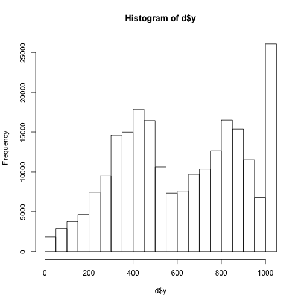 


First histogram shows tha distribution of eye gaze across x coordinates. 

(Note: dimensions of the eye-tracker screen are 1680 x 1050, check if the numbers on the histogram make sense based on those numbers!)

Below are some alternative ways to visualize the distribution, separating by subjects:


```r
# break down by subject
qplot(x, facets = ~subid, geom = "histogram", data = d)
```

```
## stat_bin: binwidth defaulted to range/30. Use 'binwidth = x' to adjust
## this. stat_bin: binwidth defaulted to range/30. Use 'binwidth = x' to
## adjust this. stat_bin: binwidth defaulted to range/30. Use 'binwidth = x'
## to adjust this. stat_bin: binwidth defaulted to range/30. Use 'binwidth =
## x' to adjust this. stat_bin: binwidth defaulted to range/30. Use 'binwidth
## = x' to adjust this. stat_bin: binwidth defaulted to range/30. Use
## 'binwidth = x' to adjust this. stat_bin: binwidth defaulted to range/30.
## Use 'binwidth = x' to adjust this.
```

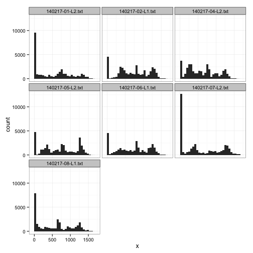 

```r
qplot(y, facets = ~subid, geom = "histogram", data = d)
```

```
## stat_bin: binwidth defaulted to range/30. Use 'binwidth = x' to adjust
## this. stat_bin: binwidth defaulted to range/30. Use 'binwidth = x' to
## adjust this. stat_bin: binwidth defaulted to range/30. Use 'binwidth = x'
## to adjust this. stat_bin: binwidth defaulted to range/30. Use 'binwidth =
## x' to adjust this. stat_bin: binwidth defaulted to range/30. Use 'binwidth
## = x' to adjust this. stat_bin: binwidth defaulted to range/30. Use
## 'binwidth = x' to adjust this. stat_bin: binwidth defaulted to range/30.
## Use 'binwidth = x' to adjust this.
```

 


We see that there is a weird peak at the end of the spectrum. This seems to be a weird default when subject is not looking at the screen or the eye tracker can't get their eye gazes. So let's get rid of those and try again.

But before that, let's just check how many NA's we have for each subj:

Then we check for missing data:

```r
# how many NAs are there in the dataset?
sum(is.na(d$x))
```

```
## [1] 4652
```

```r

# how about for each participant?  HINT: use na.action='na.pass' to pass NAs
# through aggregate
aggregate(x ~ subid, d, function(y) {
    return(sum(is.na(y)))
}, na.action = "na.pass")
```

```
##              subid    x
## 1 140217-01-L2.txt  313
## 2 140217-02-L1.txt  155
## 3 140217-04-L2.txt  202
## 4 140217-05-L2.txt   89
## 5 140217-06-L1.txt   49
## 6 140217-07-L2.txt 2308
## 7 140217-08-L1.txt 1536
```


Now, without the weird default:


```r
d <- subset(d, (y != "1050" & x != "0"))

qplot(x, facets = ~subid, geom = "histogram", data = d)
```

```
## stat_bin: binwidth defaulted to range/30. Use 'binwidth = x' to adjust
## this. stat_bin: binwidth defaulted to range/30. Use 'binwidth = x' to
## adjust this. stat_bin: binwidth defaulted to range/30. Use 'binwidth = x'
## to adjust this. stat_bin: binwidth defaulted to range/30. Use 'binwidth =
## x' to adjust this. stat_bin: binwidth defaulted to range/30. Use 'binwidth
## = x' to adjust this. stat_bin: binwidth defaulted to range/30. Use
## 'binwidth = x' to adjust this. stat_bin: binwidth defaulted to range/30.
## Use 'binwidth = x' to adjust this.
```

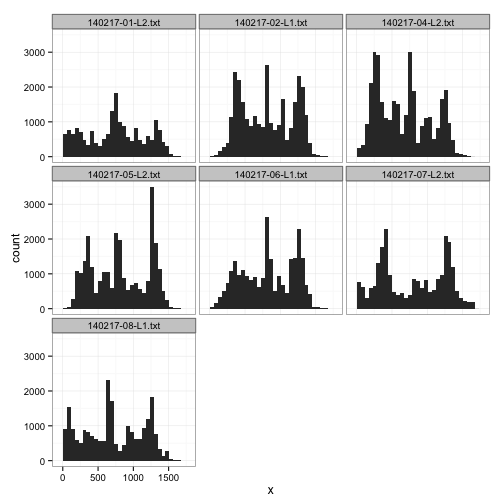 

```r
qplot(y, facets = ~subid, geom = "histogram", data = d)
```

```
## stat_bin: binwidth defaulted to range/30. Use 'binwidth = x' to adjust
## this. stat_bin: binwidth defaulted to range/30. Use 'binwidth = x' to
## adjust this. stat_bin: binwidth defaulted to range/30. Use 'binwidth = x'
## to adjust this. stat_bin: binwidth defaulted to range/30. Use 'binwidth =
## x' to adjust this. stat_bin: binwidth defaulted to range/30. Use 'binwidth
## = x' to adjust this. stat_bin: binwidth defaulted to range/30. Use
## 'binwidth = x' to adjust this. stat_bin: binwidth defaulted to range/30.
## Use 'binwidth = x' to adjust this.
```

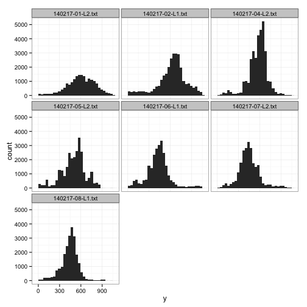 


Next, we check the location of fixations. Here we'll visualize how the gazes looked on the screen:


```r
qplot(x, y, data = d, facets = ~subid)
```

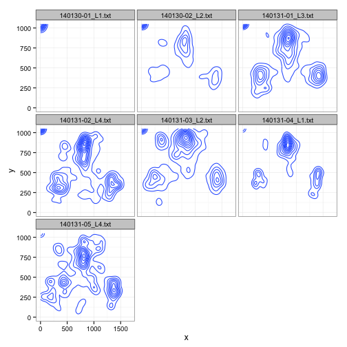 


The cool graph below helps us visualize the main regions where the gazes fell. 


```r
qplot(x, y, geom = "density2d", data = d, xlim = c(0, 1680), ylim = c(0, 1050), 
    facets = ~subid)
```

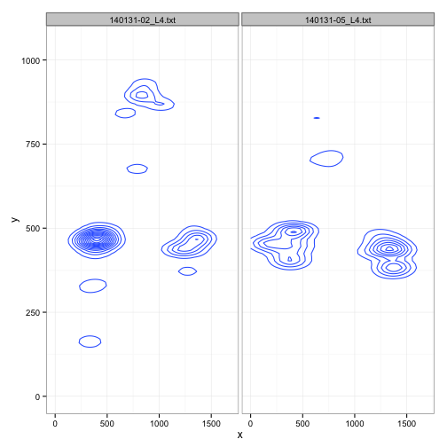 


Then we check for missing data:

```r
# how many NAs are there in the dataset?
sum(is.na(d$x))
```

```
## [1] 0
```

```r

# how about for each participant?  HINT: use na.action='na.pass' to pass NAs
# through aggregate
aggregate(x ~ subid, d, function(y) {
    return(sum(is.na(y)))
}, na.action = "na.pass")
```

```
##              subid x
## 1 140217-01-L2.txt 0
## 2 140217-02-L1.txt 0
## 3 140217-04-L2.txt 0
## 4 140217-05-L2.txt 0
## 5 140217-06-L1.txt 0
## 6 140217-07-L2.txt 0
## 7 140217-08-L1.txt 0
```


We see that the first two subjects have greater number of NA's, so maybe that signals to us that we should try to count those out later if there's anything weird in this piloting data.

### DATA ANALYSES

Now we're ready for the fun part: data analyses!
Again, run the prelim codes for sourcing scripts.

***PRELIMINARIES***
***1. Read in the orders and merge them with the data***

For this, you need to have created a csv file that specifies the onset of target word, etc., for each trial. Refer to **order1.csv** on et-ana.googlecode.com, or the columns of the order file below for an example.


```r
order <- read.csv("/Users/ericang/Documents/Erica/Stanford/2013-Q2-Winter/Research/simpimpGIT/Data_analysis/info/simpkid_order.csv")
head(order)
```

```
##         stimulus character container targetItem      trialType trialType2
## 1 simpkidsL1.012      elmo     table  teddybear control_single    control
## 2 simpkidsL1.015      elmo  lunchbox      apple      inference  inference
## 3 simpkidsL1.017    grover     chair        dog control_double    control
## 4 simpkidsL1.020      elmo     plate     banana control_single    control
## 5 simpkidsL1.022    grover     house        car      inference  inference
## 6 simpkidsL1.024     ernie  lunchbox     orange control_single    control
##   targetPos distPos targetOnset
## 1         R       L       6.242
## 2         L       R       6.410
## 3         R       L       6.750
## 4         L       R       6.111
## 5         L       R       6.213
## 6         R       L       6.617
```

```r

nrow(d)  # first check number of rows
```

```
## [1] 179263
```

```r
plot(d$stimulus)  # now check the stimulus ordering
```

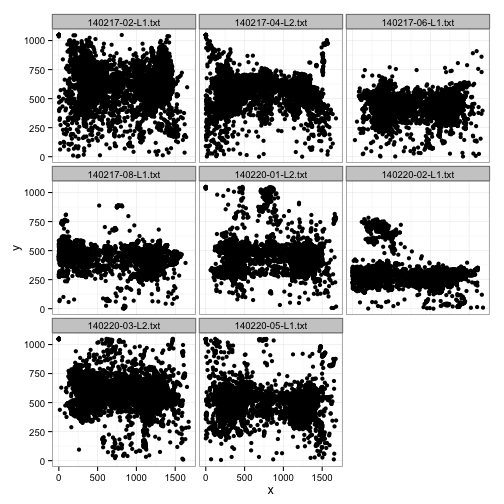 


What we do now is use the join function to combine the processed data with the order csv file, so that the data file now has info about the onset time, target item, target item location, etc.


```r
# now join in the orders
d <- join(d, order)  # use join rather than merge because it doesn't sort
```

```
## Joining by: stimulus
```

```r

plot(d$stimulus)  # check that nothing got messed up
```

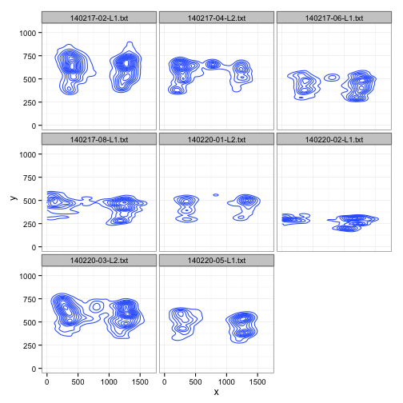 

```r
nrow(d)  # check the number of rows again
```

```
## [1] 179263
```


We see that the graph and number of rows did not get messed up by this operation.

***2. Define the target ROIs (regions of interest)***

At this stage, we define the regions of interest, which are the regions upon which the gazes fell that we care about. 


```r
rois <- list()
rois[[1]] <- c(0, 300, 840, 550)  # left
rois[[2]] <- c(840, 300, 840, 550)  # right
names(rois) <- c("L", "R")
roi.image(rois)
```

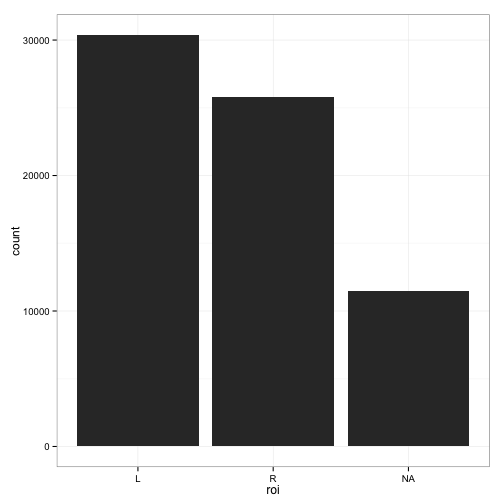 


We are using the function 'roi.image' that was specified in our helper file et_helper.R. 


```r
# use check code to make sure that ROIs look right
d$roi <- roi.check(d, rois)

# see how the distribution of ROIs looks
qplot(roi, data = d)
```

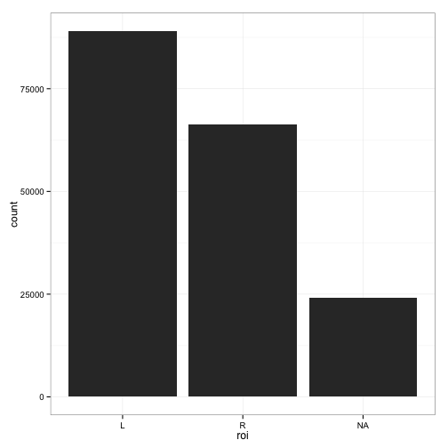 

The graph above shows the distribution of the gazes by region. Just as we would have predicted from what we saw above, the clump for center is the biggest (something to keep in mind and check that it's not a center bias for the test trials we care about)


```r
# set up correctness
d$correct <- d$roi == d$targetPos
```


Here we are saying that if the ROI fell in the region where the target item is positioned, then the column 'correct' will reflect this.


```r
# another way to organize by ROI's: set up three possible regions
d$target <- ifelse(d$roi == d$targetPos, "1", "0")
d$dist <- ifelse(d$roi == d$distPos, "1", "0")
```


Now let's only keep the rows that we care about: for the ones we have info about whether they looked at the correct target or not.

```r
# remove those rows where column 'correct' is NA
d <- subset(d, correct != "NA")

# check what we're left with
plot(d$stimulus)
```

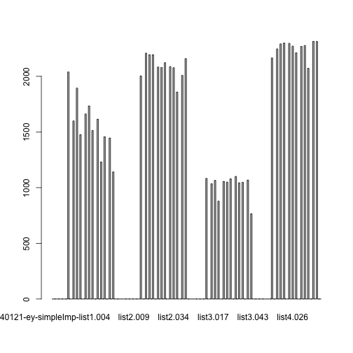 

```r
nrow(d)
```

```
## [1] 72547
```

```r
qplot(roi, data = d)
```

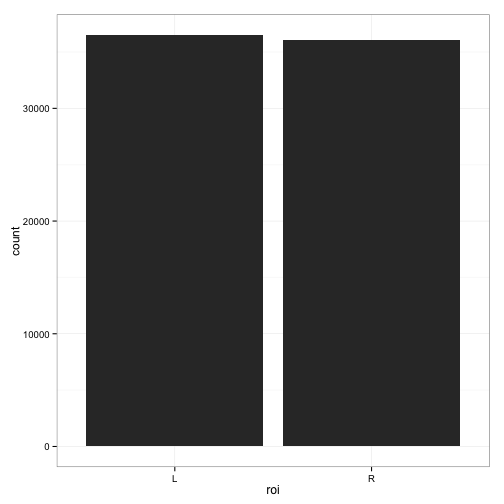 


***3. Align trials to the onset of the critical word***

Here we "create timestamps starting from the point of disambiguation".


```r
d <- rezero.trials(d)  # specified in et_helper.R
```


***4. subsample the data so that you get smooth curves***

From Mike: I like to do this when I don't have much data so that I'm not distracted by the variation in the data, but then relax the subsampling if I have more data.


```r
subsample.hz <- 5  # 10 hz is decent, eventually we should set to 30 or 60 hz
d$t.crit.binned <- round(d$t.crit * subsample.hz)/subsample.hz  # subsample step
```


***ANALYSES***

From Mike:every analysis has two parts: an aggregation step and a plotting step
- aggregation averages over some kind of unit of interest, e.g. trial type
- and then plotting is making a picture relative to that aggregation

***1. TRIAL TYPE ANALYSIS***

```r
## 1a. overall
ms <- aggregate(correct ~ t.crit.binned + trialType, d, mean)

qplot(t.crit.binned, correct, colour = trialType, geom = "line", data = ms) + 
    geom_hline(yintercept = 0.5, lty = 4) + geom_vline(xintercept = 0, lty = 3) + 
    xlab("Time (s)") + ylab("Proportion correct looking") + scale_x_continuous(limits = c(-4, 
    4), expand = c(0, 0)) + scale_y_continuous(limits = c(0, 1), expand = c(0, 
    0))  # make the axes start at 0
```

```
## Warning: Removed 41 rows containing missing values (geom_path).
```

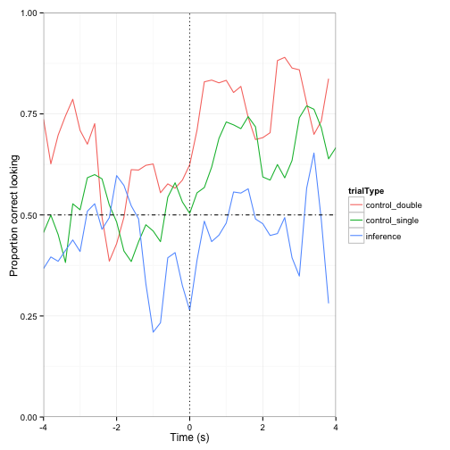 

```r

## 1aa. overall: just inference vs. control distinction
ms <- aggregate(correct ~ t.crit.binned + trialType2, d, mean)

qplot(t.crit.binned, correct, colour = trialType2, geom = "line", data = ms) + 
    geom_hline(yintercept = 0.5, lty = 4) + geom_vline(xintercept = 0, lty = 3) + 
    xlab("Time (s)") + ylab("Proportion correct looking") + scale_x_continuous(limits = c(-4, 
    4), expand = c(0, 0)) + scale_y_continuous(limits = c(0, 1), expand = c(0, 
    0))  # make the axes start at 0
```

```
## Warning: Removed 27 rows containing missing values (geom_path).
```

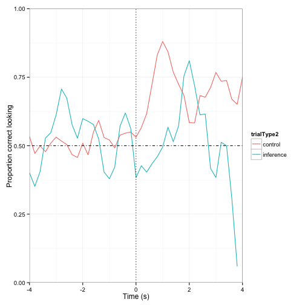 

```r

## 1a+ add error bars with 95% CI
mss <- aggregate(correct ~ t.crit.binned + trialType2 + subid, d, mean)
ms <- aggregate(correct ~ t.crit.binned + trialType2, mss, mean)
ms$cih <- aggregate(correct ~ t.crit.binned + trialType2, mss, ci.high)$correct
ms$cil <- aggregate(correct ~ t.crit.binned + trialType2, mss, ci.low)$correct

qplot(t.crit.binned, correct, colour = trialType2, geom = "line", data = ms) + 
    geom_pointrange(aes(ymin = correct - cil, ymax = correct + cih), position = position_dodge(0.05)) + 
    geom_hline(yintercept = 0.5, lty = 4) + geom_vline(xintercept = 0, lty = 3) + 
    xlab("Time (s)") + ylab("Proportion correct looking") + scale_x_continuous(limits = c(-4, 
    3), expand = c(0, 0)) + scale_y_continuous(limits = c(0, 1), expand = c(0, 
    0))  # make the axes start at 0
```

```
## Warning: Removed 36 rows containing missing values (geom_path). Warning:
## Removed 20 rows containing missing values (geom_segment). Warning: Removed
## 20 rows containing missing values (geom_point). Warning: Removed 18 rows
## containing missing values (geom_segment). Warning: Removed 18 rows
## containing missing values (geom_point).
```

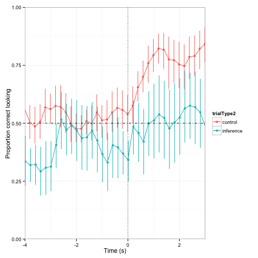 

```r

## loess
ms <- aggregate(correct ~ t.crit.binned + trialType, d, mean)

qplot(t.crit.binned, correct, colour = trialType, geom = "point", data = ms) + 
    geom_hline(yintercept = 0.5, lty = 4) + geom_vline(xintercept = 0, lty = 3) + 
    geom_smooth(method = "loess", span = 0.5) + xlab("Time (s)") + ylab("Proportion correct looking") + 
    scale_x_continuous(limits = c(-2, 4), expand = c(0, 0)) + scale_y_continuous(limits = c(0, 
    1), expand = c(0, 0))
```

```
## Warning: Removed 24 rows containing missing values (stat_smooth). Warning:
## Removed 24 rows containing missing values (stat_smooth). Warning: Removed
## 23 rows containing missing values (stat_smooth). Warning: Removed 71 rows
## containing missing values (geom_point).
```

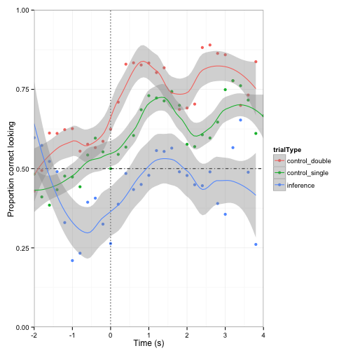 


Now let's try to make a graph that shows both possible eye-gaze locations: target and distractor. 


```r
## gaze at target vs. distractor
subsample.hz <- 5  # 10 hz is decent, eventually we should set to 30 or 60 hz
d$t.crit.binned <- round(d$t.crit * subsample.hz)/subsample.hz  # subsample step

melted = melt(d, id = c("t.crit.binned", "trialType2"), measure = c("target", 
    "dist"), value.name = "Looks", variable.name = "Region")
melted$Looks = to.n(melted$Looks)

ms <- aggregate(Looks ~ Region + t.crit.binned + trialType2, melted, mean)

qplot(t.crit.binned, Looks, colour = trialType2, linetype = Region, geom = "line", 
    data = ms) + geom_hline(yintercept = 0.5, lty = 4) + geom_vline(xintercept = 0, 
    lty = 3) + xlab("Time (s)") + ylab("Proportion Looking") + scale_x_continuous(limits = c(-4, 
    3), expand = c(0, 0)) + scale_y_continuous(limits = c(0, 1), expand = c(0, 
    0))  # make the axes start at 0
```

```
## Warning: Removed 72 rows containing missing values (geom_path).
```

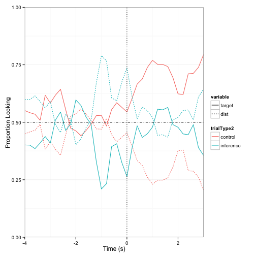 


Splitting by target location:


```r
## 1e. target positions
ms <- aggregate(correct ~ t.crit.binned + trialType + targetPos, d, mean)

qplot(t.crit.binned, correct, colour = trialType, geom = "point", data = ms) + 
    facet_grid(. ~ targetPos) + geom_hline(yintercept = 0.5, lty = 4) + geom_vline(xintercept = 0, 
    lty = 3) + geom_smooth() + xlab("Time (s)") + ylab("Proportion correct looking") + 
    scale_x_continuous(limits = c(-3, 3), expand = c(0, 0)) + scale_y_continuous(limits = c(0, 
    1), expand = c(0, 0))  # make the axes start at 0
```

```
## geom_smooth: method="auto" and size of largest group is <1000, so using
## loess. Use 'method = x' to change the smoothing method.
```

```
## Warning: Removed 22 rows containing missing values (stat_smooth). Warning:
## Removed 23 rows containing missing values (stat_smooth). Warning: Removed
## 21 rows containing missing values (stat_smooth).
```

```
## geom_smooth: method="auto" and size of largest group is <1000, so using
## loess. Use 'method = x' to change the smoothing method.
```

```
## Warning: Removed 23 rows containing missing values (stat_smooth). Warning:
## Removed 23 rows containing missing values (stat_smooth). Warning: Removed
## 22 rows containing missing values (stat_smooth). Warning: Removed 66 rows
## containing missing values (geom_point). Warning: Removed 68 rows
## containing missing values (geom_point).
```

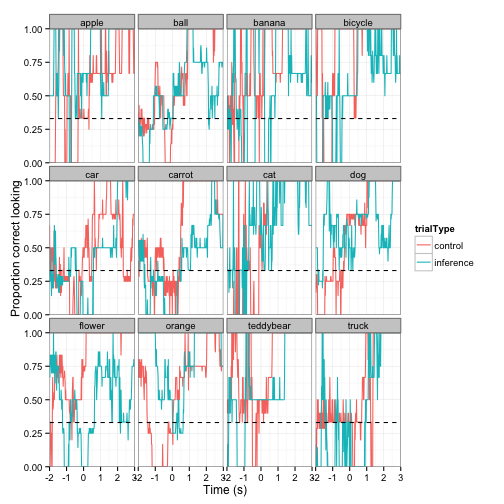 


Then we see how each partcipant performed:


```r
## 1b. by participant
ms <- aggregate(correct ~ t.crit.binned + trialType + subid, d, mean)

qplot(t.crit.binned, correct, colour = trialType, geom = "point", data = ms) + 
    facet_wrap(~subid) + geom_hline(yintercept = 0.5, lty = 4) + geom_vline(xintercept = 0, 
    lty = 3) + geom_smooth() + xlab("Time (s)") + ylab("Proportion correct looking") + 
    scale_x_continuous(limits = c(-4, 5), expand = c(0, 0)) + scale_y_continuous(limits = c(0, 
    1), expand = c(0, 0))  # make the axes start at 0
```

```
## geom_smooth: method="auto" and size of largest group is <1000, so using
## loess. Use 'method = x' to change the smoothing method.
```

```
## Warning: Removed 13 rows containing missing values (stat_smooth). Warning:
## Removed 14 rows containing missing values (stat_smooth).
```

```
## geom_smooth: method="auto" and size of largest group is <1000, so using
## loess. Use 'method = x' to change the smoothing method.
```

```
## Warning: Removed 13 rows containing missing values (stat_smooth). Warning:
## Removed 11 rows containing missing values (stat_smooth). Warning: Removed
## 12 rows containing missing values (stat_smooth).
```

```
## geom_smooth: method="auto" and size of largest group is <1000, so using
## loess. Use 'method = x' to change the smoothing method.
```

```
## Warning: Removed 13 rows containing missing values (stat_smooth). Warning:
## Removed 14 rows containing missing values (stat_smooth). Warning: Removed
## 13 rows containing missing values (stat_smooth).
```

```
## geom_smooth: method="auto" and size of largest group is <1000, so using
## loess. Use 'method = x' to change the smoothing method.
```

```
## Warning: Removed 12 rows containing missing values (stat_smooth). Warning:
## Removed 12 rows containing missing values (stat_smooth). Warning: Removed
## 12 rows containing missing values (stat_smooth).
```

```
## geom_smooth: method="auto" and size of largest group is <1000, so using
## loess. Use 'method = x' to change the smoothing method.
```

```
## Warning: Removed 14 rows containing missing values (stat_smooth). Warning:
## Removed 13 rows containing missing values (stat_smooth). Warning: Removed
## 12 rows containing missing values (stat_smooth).
```

```
## geom_smooth: method="auto" and size of largest group is <1000, so using
## loess. Use 'method = x' to change the smoothing method.
```

```
## Warning: Removed 13 rows containing missing values (stat_smooth). Warning:
## Removed 14 rows containing missing values (stat_smooth). Warning: Removed
## 13 rows containing missing values (stat_smooth).
```

```
## geom_smooth: method="auto" and size of largest group is <1000, so using
## loess. Use 'method = x' to change the smoothing method.
```

```
## Warning: Removed 14 rows containing missing values (stat_smooth). Warning:
## Removed 13 rows containing missing values (stat_smooth). Warning: Removed
## 12 rows containing missing values (stat_smooth). Warning: Removed 27 rows
## containing missing values (geom_point). Warning: Removed 36 rows
## containing missing values (geom_point). Warning: Removed 40 rows
## containing missing values (geom_point). Warning: Removed 36 rows
## containing missing values (geom_point). Warning: Removed 39 rows
## containing missing values (geom_point). Warning: Removed 40 rows
## containing missing values (geom_point). Warning: Removed 39 rows
## containing missing values (geom_point). Warning: Removed 2 rows containing
## missing values (geom_path). Warning: Removed 4 rows containing missing
## values (geom_path). Warning: Removed 4 rows containing missing values
## (geom_path). Warning: Removed 1 rows containing missing values
## (geom_path). Warning: Removed 4 rows containing missing values
## (geom_path). Warning: Removed 3 rows containing missing values
## (geom_path).
```

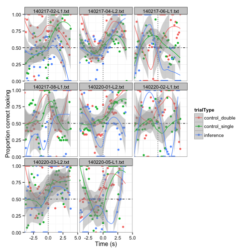 


***2. BY ITEM ANALYSIS***

From Mike: this won't look good until we have a lot of data because we are dividing our data in 6 parts


```r
ms <- aggregate(correct ~ t.crit.binned + trialType + targetItem, d, mean)

qplot(t.crit.binned, correct, colour = trialType, facets = ~targetItem, geom = "line", 
    data = ms) + geom_hline(yintercept = 0.5, lty = 2) + xlab("Time (s)") + 
    ylab("Proportion correct looking") + scale_x_continuous(limits = c(-2, 3), 
    expand = c(0, 0)) + scale_y_continuous(limits = c(0, 1), expand = c(0, 0))
```

```
## Warning: Removed 75 rows containing missing values (geom_path). Warning:
## Removed 75 rows containing missing values (geom_path). Warning: Removed 26
## rows containing missing values (geom_path). Warning: Removed 49 rows
## containing missing values (geom_path). Warning: Removed 75 rows containing
## missing values (geom_path). Warning: Removed 50 rows containing missing
## values (geom_path). Warning: Removed 51 rows containing missing values
## (geom_path). Warning: Removed 50 rows containing missing values
## (geom_path). Warning: Removed 74 rows containing missing values
## (geom_path). Warning: Removed 43 rows containing missing values
## (geom_path). Warning: Removed 48 rows containing missing values
## (geom_path). Warning: Removed 25 rows containing missing values
## (geom_path).
```

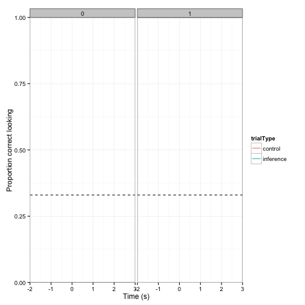 


***3. DWELL TIME IN WINDOW ANALYSIS***

From Mike: this will look good because we're averaging considerably


```r
window <- c(0.5, 4)
mss <- aggregate(correct ~ trialType + subid, subset(d, t.crit.binned > window[1] & 
    t.crit.binned < window[2]), mean)
ms <- aggregate(correct ~ trialType, mss, mean)
ms$cih <- aggregate(correct ~ trialType, mss, ci.high)$correct
ms$cil <- aggregate(correct ~ trialType, mss, ci.low)$correct

qplot(trialType, correct, fill = trialType, stat = "identity", geom = "bar", 
    ylim = c(0, 1), data = ms) + ylab("Proportion correct looking") + geom_hline(yintercept = 0.5, 
    lty = 4) + geom_errorbar(aes(ymin = correct - cil, ymax = correct + cih, 
    width = 0.2))
```

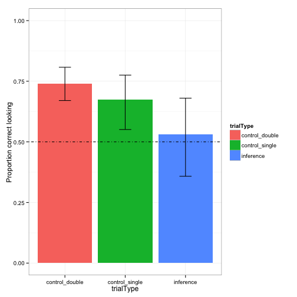 

```r

ms <- aggregate(correct ~ trialType + subid, mss, mean)
ms$cih <- aggregate(correct ~ trialType + subid, mss, ci.high)$correct
ms$cil <- aggregate(correct ~ trialType + subid, mss, ci.low)$correct

qplot(trialType, correct, fill = trialType, stat = "identity", geom = "bar", 
    ylim = c(0, 1), data = ms) + ylab("Proportion correct looking") + geom_hline(yintercept = 0.5, 
    lty = 4) + geom_errorbar(aes(ymin = correct - cil, ymax = correct + cih, 
    width = 0.2)) + facet_wrap(~subid)
```

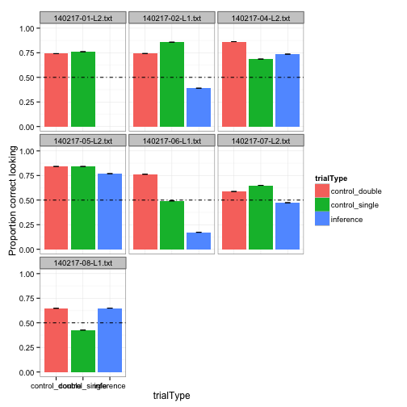 

