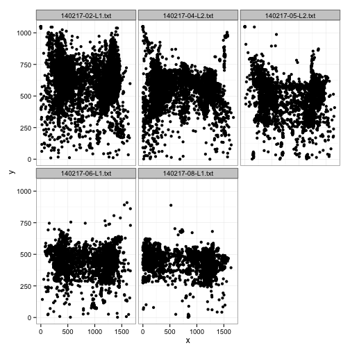
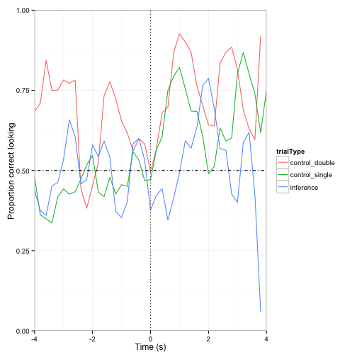
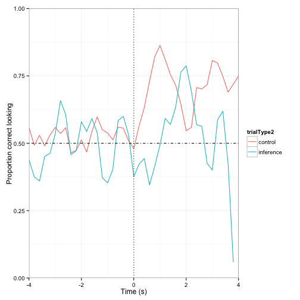
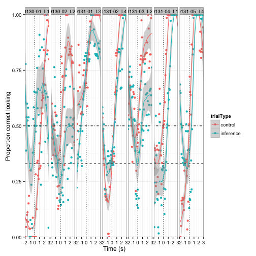
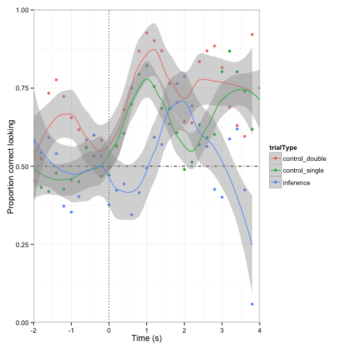
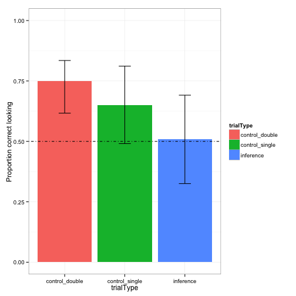
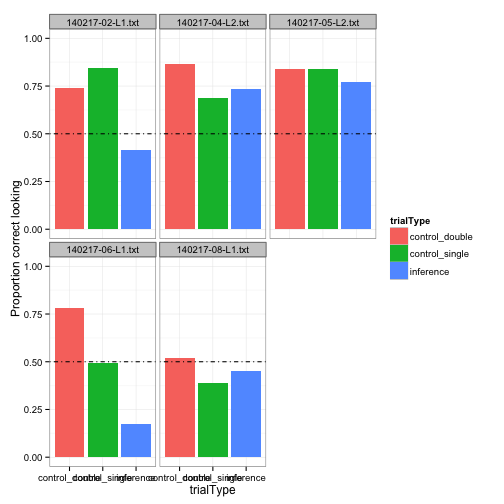
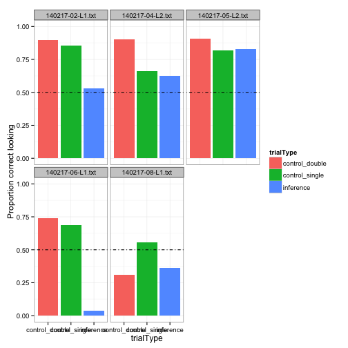

EJY Simpimp: Data analysis for eye-tracking (SIMPKID- first8kids)
========================================================
### BEFORE STARTING
Before working on preprocessing and analyzing the data, make sure you have: 
- converted your idf file into a txt file using the idf converter. Refer to langcog wiki if you don't know how to do this!
- changed your raw data file name if needed.
- (If this is your first time analyzing some eye-tracking data) gone to et-ana.googlecode.com and clicked on: Source -> Browse -> (Directory) trunk, and downloaded: 
  et_helper.R, praglook_ana.R, praglook_preprocess.R, praglook_sanitycheck.R, useful.R (Change the names of these files to be specific for your own experiment: for example, my file was simpimp_preprocess.R because my experiment is called simpimp).
- created a directory for data analysis that have these following folders within: 
  1) raw_data: where you put the raw data in txt format!
  2) processed_data: where the processed data (i.e., rearranged version of the raw data) will be stored after running the functions below!
  3) R-scripts: for all the useful R scripts for analyses that you downloaded from et-ana webpage
  4) info: mostly for storing the 'order' file, which I'll describe later.

### PREPROCESSING

When you have these ready, you're ready to preprocess the data!
Open up the file simpimp_preprocess.R (or whatever yours is called!) on R Studio. Below I will follow the codes specified in this file step by step, to demonstrate what each thing does.

Run these first codes for some prelim prep:

```r
rm(list = ls())
setwd("/Users/ericang/Documents/Erica/Stanford/2013-Q2-Winter/Research/simpimpGIT/Data_analysis/")
source("R_scripts/useful.R")
```

```
## Warning: package 'bootstrap' was built under R version 3.0.2
```

```
## Loading required package: lattice Loading required package: Matrix
## 
## Attaching package: 'lme4'
## 
## The following object is masked from 'package:ggplot2':
## 
## fortify
```

```r
source("R_scripts/et_helper.R")
```


The R scripts specified above (useful.R, et_helper.R) are helper files that we call on for some functions needed for analyses. For example, function 'rezero.trials()' is established in the file et_helper.R. Look inside the files to see what functions are built in those!
Also, this means the name conventions your files use all have to be matched and consistent. For instance, the function 'rezero.trials()' calls on the column that specifies the onset time (i.e., exact time when the target word is produced) in your csv file. I had a trouble with this function at first, and then I discovered that the reason was because I had named the column different ('targetOnset') from the way it was specified in the function before ('target.onset'). So either go with the convention all the time, or be sure to go through these functions and change whatever was the convention that YOU used in the files you're using.

Specify the directories from which you'll get files:

```r
raw.data.path <- "raw_data/"
info.path <- "info/"
processed.data.path <- "processed_data/"
```


Below is the preprocessing stage:

```r
## LOOP TO READ IN FILES
all.data <- data.frame()
files <- dir(raw.data.path, pattern = "*.txt")
```

What we did above is to call all files with the extension 'txt' and save them into the variable 'files'.

Before we go on the next step, make sure that there are in fact 38 header rows (before the data starts), as the function below states. You can do this by opening your raw data file in a program that shows the number of rows (e.g., textWrangler).


```r
for (file.name in files) {
    print(file.name)
    
    ## these are the two functions that are most meaningful
    d <- read.smi.idf(paste(raw.data.path, file.name, sep = ""), header.rows = 35)
    d <- preprocess.data(d)
    d$subid <- file.name
    
    ## now here's where data get bound together
    all.data <- rbind(all.data, d)
}

## WRITE DATA OUT TO CSV FOR EASY ACCESS
write.csv(all.data, paste(processed.data.path, "simpimp_processed.csv", sep = ""), 
    row.names = FALSE)
```

```
## Warning: cannot open file 'processed_data/simpimp_processed.csv': No such
## file or directory
```

```
## Error: cannot open the connection
```


Now preprocessing is done! Next we save this as csv so that it can be easily accessed. (Code not shown here)

The csv file should have been saved onto the folder 'processed_data'. Open the folder and check if the file exists, and open the file to check that it's been preprocessed properly. First few rows of mine look like this:


```r
d <- read.csv("/Users/ericang/Documents/Erica/Stanford/2013-Q2-Winter/Research/simpimpGIT/Data_analysis/processed_data/simpimp_processed.csv")
head(d)
```

```
##      t          stimulus x    y t.stim            subid
## 1 0.00 elmo_tapping1.avi 0 1050   0.05 140217-01-L2.txt
## 2 0.05 elmo_tapping1.avi 0 1050   0.10 140217-01-L2.txt
## 3 0.10 elmo_tapping1.avi 0 1050   0.15 140217-01-L2.txt
## 4 0.15 elmo_tapping1.avi 0 1050   0.20 140217-01-L2.txt
## 5 0.20 elmo_tapping1.avi 0 1050   0.25 140217-01-L2.txt
## 6 0.25 elmo_tapping1.avi 0 1050   0.30 140217-01-L2.txt
```


Columns:
t: how much time has passed since the exp began
x and y: coordinates where the eye gaze is. 
t.stim: how much time has passed since the stimulus 'elmo_duck.avi', for example, has started playing. 
subid: the subject id. this is the name of the raw data file, so make sure the name is a sensible one!

### KEEP AND DROP

Before analyzing the data, we need to determine keep's and drop's. Run the package 'reshape'


```r
# Libraries
library(reshape)
```

```
## Attaching package: 'reshape'
## 
## The following object is masked from 'package:plyr':
## 
## rename, round_any
## 
## The following object is masked from 'package:reshape2':
## 
## colsplit, melt, recast
## 
## The following object is masked from 'package:Matrix':
## 
## expand
```


***Read in the orders and merge them with the data***

This step was initially part of the stage after all the sanity check, but I've decided to move it here because it's useful for us to focus on the part that we care about from the start.

For this, you need to have created a csv file that specifies the onset of target word, etc., for each trial. Refer to **order1.csv** on et-ana.googlecode.com, or the columns of the order file below for an example.


```r
order <- read.csv("/Users/ericang/Documents/Erica/Stanford/2013-Q2-Winter/Research/simpimpGIT/Data_analysis/info/simpkid_order.csv")
head(order)
```

```
##         stimulus character container targetItem      trialType trialType2
## 1 simpkidsL1.012      elmo     table  teddybear control_single    control
## 2 simpkidsL1.015      elmo  lunchbox      apple      inference  inference
## 3 simpkidsL1.017    grover     chair        dog control_double    control
## 4 simpkidsL1.020      elmo     plate     banana control_single    control
## 5 simpkidsL1.022    grover     house        car      inference  inference
## 6 simpkidsL1.024     ernie  lunchbox     orange control_single    control
##   targetPos distPos targetOnset
## 1         R       L       6.242
## 2         L       R       6.410
## 3         R       L       6.750
## 4         L       R       6.111
## 5         L       R       6.213
## 6         R       L       6.617
```

```r

nrow(d)  # first check number of rows
```

```
## [1] 235193
```

```r
plot(d$stimulus)  # now check the stimulus ordering
```

 


What we do now is use the join function to combine the processed data with the order csv file, so that the data file now has info about the onset time, target item, target item location, etc.


```r
# now join in the orders
d <- join(d, order)  # use join rather than merge because it doesn't sort
```

```
## Joining by: stimulus
```

```r

plot(d$stimulus)  # check that nothing got messed up
```

 

```r
nrow(d)  # check the number of rows again to see it remained the same
```

```
## [1] 235193
```

```r
head(d)
```

```
##      t          stimulus x    y t.stim            subid character
## 1 0.00 elmo_tapping1.avi 0 1050   0.05 140217-01-L2.txt      <NA>
## 2 0.05 elmo_tapping1.avi 0 1050   0.10 140217-01-L2.txt      <NA>
## 3 0.10 elmo_tapping1.avi 0 1050   0.15 140217-01-L2.txt      <NA>
## 4 0.15 elmo_tapping1.avi 0 1050   0.20 140217-01-L2.txt      <NA>
## 5 0.20 elmo_tapping1.avi 0 1050   0.25 140217-01-L2.txt      <NA>
## 6 0.25 elmo_tapping1.avi 0 1050   0.30 140217-01-L2.txt      <NA>
##   container targetItem trialType trialType2 targetPos distPos targetOnset
## 1      <NA>       <NA>      <NA>       <NA>      <NA>    <NA>          NA
## 2      <NA>       <NA>      <NA>       <NA>      <NA>    <NA>          NA
## 3      <NA>       <NA>      <NA>       <NA>      <NA>    <NA>          NA
## 4      <NA>       <NA>      <NA>       <NA>      <NA>    <NA>          NA
## 5      <NA>       <NA>      <NA>       <NA>      <NA>    <NA>          NA
## 6      <NA>       <NA>      <NA>       <NA>      <NA>    <NA>          NA
```

```
We see that the graph and number of rows did not get messed up by this operation.

There is a weird default for the eye-tracker such that when you are not looking, the coordinates recorded is (0,1050). So let's get rid of these default coordinates, by making them into NA's.


```r
d$x[d$y == "1050" & d$x == "0"] <- NA
d$y[d$y == "1050"] <- NA
head(d)
```

```
##      t          stimulus  x  y t.stim            subid character container
## 1 0.00 elmo_tapping1.avi NA NA   0.05 140217-01-L2.txt      <NA>      <NA>
## 2 0.05 elmo_tapping1.avi NA NA   0.10 140217-01-L2.txt      <NA>      <NA>
## 3 0.10 elmo_tapping1.avi NA NA   0.15 140217-01-L2.txt      <NA>      <NA>
## 4 0.15 elmo_tapping1.avi NA NA   0.20 140217-01-L2.txt      <NA>      <NA>
## 5 0.20 elmo_tapping1.avi NA NA   0.25 140217-01-L2.txt      <NA>      <NA>
## 6 0.25 elmo_tapping1.avi NA NA   0.30 140217-01-L2.txt      <NA>      <NA>
##   targetItem trialType trialType2 targetPos distPos targetOnset
## 1       <NA>      <NA>       <NA>      <NA>    <NA>          NA
## 2       <NA>      <NA>       <NA>      <NA>    <NA>          NA
## 3       <NA>      <NA>       <NA>      <NA>    <NA>          NA
## 4       <NA>      <NA>       <NA>      <NA>    <NA>          NA
## 5       <NA>      <NA>       <NA>      <NA>    <NA>          NA
## 6       <NA>      <NA>       <NA>      <NA>    <NA>          NA
```

```r
# make a column that shows whether NA (true) or not (false)
d$count.na <- is.na(d$x)
head(d)
```

```
##      t          stimulus  x  y t.stim            subid character container
## 1 0.00 elmo_tapping1.avi NA NA   0.05 140217-01-L2.txt      <NA>      <NA>
## 2 0.05 elmo_tapping1.avi NA NA   0.10 140217-01-L2.txt      <NA>      <NA>
## 3 0.10 elmo_tapping1.avi NA NA   0.15 140217-01-L2.txt      <NA>      <NA>
## 4 0.15 elmo_tapping1.avi NA NA   0.20 140217-01-L2.txt      <NA>      <NA>
## 5 0.20 elmo_tapping1.avi NA NA   0.25 140217-01-L2.txt      <NA>      <NA>
## 6 0.25 elmo_tapping1.avi NA NA   0.30 140217-01-L2.txt      <NA>      <NA>
##   targetItem trialType trialType2 targetPos distPos targetOnset count.na
## 1       <NA>      <NA>       <NA>      <NA>    <NA>          NA     TRUE
## 2       <NA>      <NA>       <NA>      <NA>    <NA>          NA     TRUE
## 3       <NA>      <NA>       <NA>      <NA>    <NA>          NA     TRUE
## 4       <NA>      <NA>       <NA>      <NA>    <NA>          NA     TRUE
## 5       <NA>      <NA>       <NA>      <NA>    <NA>          NA     TRUE
## 6       <NA>      <NA>       <NA>      <NA>    <NA>          NA     TRUE
```

```r

# remove those rows where column 'targetOnset' is NA (i.e., rows that are
# not showing test trials)
d <- subset(d, targetOnset != "NA")
head(d)
```

```
##         t       stimulus   x   y   t.stim            subid character
## 14892 186 simpkidsL2.012 409 509 0.008333 140217-01-L2.txt    grover
## 14893 186 simpkidsL2.012 409 504 0.016667 140217-01-L2.txt    grover
## 14894 186 simpkidsL2.012 402 505 0.025000 140217-01-L2.txt    grover
## 14895 186 simpkidsL2.012 411 503 0.033333 140217-01-L2.txt    grover
## 14896 186 simpkidsL2.012 407 499 0.041667 140217-01-L2.txt    grover
## 14897 186 simpkidsL2.012 404 498 0.050000 140217-01-L2.txt    grover
##       container targetItem      trialType trialType2 targetPos distPos
## 14892  lunchbox     orange control_single    control         R       L
## 14893  lunchbox     orange control_single    control         R       L
## 14894  lunchbox     orange control_single    control         R       L
## 14895  lunchbox     orange control_single    control         R       L
## 14896  lunchbox     orange control_single    control         R       L
## 14897  lunchbox     orange control_single    control         R       L
##       targetOnset count.na
## 14892       6.724    FALSE
## 14893       6.724    FALSE
## 14894       6.724    FALSE
## 14895       6.724    FALSE
## 14896       6.724    FALSE
## 14897       6.724    FALSE
```

```r

## TRIAL REJECTION: reject trials that have NAs for over 30% of their samples
trial.nas <- ddply(d, c("subid", "stimulus", "count.na"), "nrow")
trial.nas <- reshape(trial.nas, timevar = "count.na", idvar = c("subid", "stimulus"), 
    direction = "wide")
names(trial.nas) <- c("subid", "stimulus", "false", "true")
head(trial.nas)
```

```
##               subid       stimulus false true
## 1  140217-01-L2.txt simpkidsL2.012  1055  144
## 3  140217-01-L2.txt simpkidsL2.015    NA  200
## 4  140217-01-L2.txt simpkidsL2.017   439  344
## 6  140217-01-L2.txt simpkidsL2.020   693  177
## 8  140217-01-L2.txt simpkidsL2.022    30  302
## 10 140217-01-L2.txt simpkidsL2.024    69  306
```

```r
# calculate the proportion of non-NA's over all
trial.nas$prop <- trial.nas$false/(trial.nas$true + trial.nas$false)
head(trial.nas)
```

```
##               subid       stimulus false true    prop
## 1  140217-01-L2.txt simpkidsL2.012  1055  144 0.87990
## 3  140217-01-L2.txt simpkidsL2.015    NA  200      NA
## 4  140217-01-L2.txt simpkidsL2.017   439  344 0.56066
## 6  140217-01-L2.txt simpkidsL2.020   693  177 0.79655
## 8  140217-01-L2.txt simpkidsL2.022    30  302 0.09036
## 10 140217-01-L2.txt simpkidsL2.024    69  306 0.18400
```

```r
reject.trials <- trial.nas[trial.nas$prop < 0.7, ]

# add a column in data that combines subid and stim (trial)
d$subtrial <- paste(d$subid, "_", d$stimulus, sep = "")
# reject trials
reject.trials$subtrial <- paste(reject.trials$subid, "_", reject.trials$stimulus, 
    sep = "")
print(reject.trials)
```

```
##                 subid       stimulus false true    prop
## NA               <NA>           <NA>    NA   NA      NA
## 4    140217-01-L2.txt simpkidsL2.017   439  344 0.56066
## 8    140217-01-L2.txt simpkidsL2.022    30  302 0.09036
## 10   140217-01-L2.txt simpkidsL2.024    69  306 0.18400
## 14   140217-01-L2.txt simpkidsL2.029   583  298 0.66175
## 46   140217-02-L1.txt simpkidsL1.041   534  282 0.65441
## 50   140217-02-L1.txt simpkidsL1.046   207  286 0.41988
## 92   140217-05-L2.txt simpkidsL2.020   277  216 0.56187
## NA.1             <NA>           <NA>    NA   NA      NA
## NA.2             <NA>           <NA>    NA   NA      NA
## 112  140217-05-L2.txt simpkidsL2.046    58  227 0.20351
## NA.3             <NA>           <NA>    NA   NA      NA
## 125  140217-06-L1.txt simpkidsL1.024   410  212 0.65916
## 137  140217-06-L1.txt simpkidsL1.039   243  227 0.51702
## 139  140217-06-L1.txt simpkidsL1.041   547  262 0.67614
## 141  140217-06-L1.txt simpkidsL1.043   347  178 0.66095
## NA.4             <NA>           <NA>    NA   NA      NA
## 146  140217-07-L2.txt simpkidsL2.012   500  699 0.41701
## 148  140217-07-L2.txt simpkidsL2.015   647  552 0.53962
## 150  140217-07-L2.txt simpkidsL2.017   494  705 0.41201
## 152  140217-07-L2.txt simpkidsL2.020   683  516 0.56964
## 154  140217-07-L2.txt simpkidsL2.022   561  638 0.46789
## 156  140217-07-L2.txt simpkidsL2.024   834  365 0.69558
## 158  140217-07-L2.txt simpkidsL2.027   467  724 0.39211
## 160  140217-07-L2.txt simpkidsL2.029   807  389 0.67475
## 162  140217-07-L2.txt simpkidsL2.032   467  729 0.39047
## 164  140217-07-L2.txt simpkidsL2.034   507  690 0.42356
## 168  140217-07-L2.txt simpkidsL2.039   602  597 0.50209
## 170  140217-07-L2.txt simpkidsL2.041   450  744 0.37688
## 172  140217-07-L2.txt simpkidsL2.043   631  563 0.52848
## 174  140217-07-L2.txt simpkidsL2.046   771  426 0.64411
## 176  140217-07-L2.txt simpkidsL2.048   418  779 0.34921
## 178  140217-08-L1.txt simpkidsL1.012   703  452 0.60866
## NA.5             <NA>           <NA>    NA   NA      NA
## NA.6             <NA>           <NA>    NA   NA      NA
## NA.7             <NA>           <NA>    NA   NA      NA
## 191  140217-08-L1.txt simpkidsL1.032   673  352 0.65659
## 199  140217-08-L1.txt simpkidsL1.041   156  238 0.39594
## NA.8             <NA>           <NA>    NA   NA      NA
## 202  140217-08-L1.txt simpkidsL1.046   561  283 0.66469
##                             subtrial
## NA                             NA_NA
## 4    140217-01-L2.txt_simpkidsL2.017
## 8    140217-01-L2.txt_simpkidsL2.022
## 10   140217-01-L2.txt_simpkidsL2.024
## 14   140217-01-L2.txt_simpkidsL2.029
## 46   140217-02-L1.txt_simpkidsL1.041
## 50   140217-02-L1.txt_simpkidsL1.046
## 92   140217-05-L2.txt_simpkidsL2.020
## NA.1                           NA_NA
## NA.2                           NA_NA
## 112  140217-05-L2.txt_simpkidsL2.046
## NA.3                           NA_NA
## 125  140217-06-L1.txt_simpkidsL1.024
## 137  140217-06-L1.txt_simpkidsL1.039
## 139  140217-06-L1.txt_simpkidsL1.041
## 141  140217-06-L1.txt_simpkidsL1.043
## NA.4                           NA_NA
## 146  140217-07-L2.txt_simpkidsL2.012
## 148  140217-07-L2.txt_simpkidsL2.015
## 150  140217-07-L2.txt_simpkidsL2.017
## 152  140217-07-L2.txt_simpkidsL2.020
## 154  140217-07-L2.txt_simpkidsL2.022
## 156  140217-07-L2.txt_simpkidsL2.024
## 158  140217-07-L2.txt_simpkidsL2.027
## 160  140217-07-L2.txt_simpkidsL2.029
## 162  140217-07-L2.txt_simpkidsL2.032
## 164  140217-07-L2.txt_simpkidsL2.034
## 168  140217-07-L2.txt_simpkidsL2.039
## 170  140217-07-L2.txt_simpkidsL2.041
## 172  140217-07-L2.txt_simpkidsL2.043
## 174  140217-07-L2.txt_simpkidsL2.046
## 176  140217-07-L2.txt_simpkidsL2.048
## 178  140217-08-L1.txt_simpkidsL1.012
## NA.5                           NA_NA
## NA.6                           NA_NA
## NA.7                           NA_NA
## 191  140217-08-L1.txt_simpkidsL1.032
## 199  140217-08-L1.txt_simpkidsL1.041
## NA.8                           NA_NA
## 202  140217-08-L1.txt_simpkidsL1.046
```

```r
for (i in reject.trials$subtrial) {
    d <- d[d$subtrial != i, ]
}

## SUBJECT REJECTION: reject trials that have NAs for over 30% of their
## trials
subject.nas <- ddply(d, c("subid", "stimulus"), "nrow")
subject.nas2 <- ddply(subject.nas, "subid", "nrow")
print(subject.nas2)
```

```
##              subid nrow
## 1 140217-01-L2.txt    7
## 2 140217-02-L1.txt   14
## 3 140217-04-L2.txt   16
## 4 140217-05-L2.txt   14
## 5 140217-06-L1.txt   12
## 6 140217-07-L2.txt    1
## 7 140217-08-L1.txt   12
```

```r
## reject subjects that have less than 70% of the trials remaining (11 out of
## 16)
reject.subjects <- subject.nas2[subject.nas2$nrow < 11, ]
print(reject.subjects)
```

```
##              subid nrow
## 1 140217-01-L2.txt    7
## 6 140217-07-L2.txt    1
```

```r
for (i in reject.subjects$subid) {
    d <- d[d$subid != i, ]
}
```


### SANITY CHECK
Now let's do some sanity check.
Open up the file simpimp_sanitycheck.R, and run the preliminary codes again.

First let's look at the distribution of data:

```r
# do histograms of the data for x and y coordinates
hist(d$x)
```

 

```r
hist(d$y)
```

 


First histogram shows tha distribution of eye gaze across x coordinates. 

(Note: dimensions of the eye-tracker screen are 1680 x 1050, check if the numbers on the histogram make sense based on those numbers!)

Below are some alternative ways to visualize the distribution, separating by subjects:


```r
# break down by subject
qplot(x, facets = ~subid, geom = "histogram", data = d)
```

```
## stat_bin: binwidth defaulted to range/30. Use 'binwidth = x' to adjust
## this. stat_bin: binwidth defaulted to range/30. Use 'binwidth = x' to
## adjust this. stat_bin: binwidth defaulted to range/30. Use 'binwidth = x'
## to adjust this. stat_bin: binwidth defaulted to range/30. Use 'binwidth =
## x' to adjust this. stat_bin: binwidth defaulted to range/30. Use 'binwidth
## = x' to adjust this.
```

 

```r
qplot(y, facets = ~subid, geom = "histogram", data = d)
```

```
## stat_bin: binwidth defaulted to range/30. Use 'binwidth = x' to adjust
## this. stat_bin: binwidth defaulted to range/30. Use 'binwidth = x' to
## adjust this. stat_bin: binwidth defaulted to range/30. Use 'binwidth = x'
## to adjust this. stat_bin: binwidth defaulted to range/30. Use 'binwidth =
## x' to adjust this. stat_bin: binwidth defaulted to range/30. Use 'binwidth
## = x' to adjust this.
```

 


Next, we check the location of fixations. Here we'll visualize how the gazes looked on the screen:


```r
qplot(x, y, data = d, facets = ~subid)
```

```
## Warning: Removed 1604 rows containing missing values (geom_point).
## Warning: Removed 1575 rows containing missing values (geom_point).
## Warning: Removed 1273 rows containing missing values (geom_point).
## Warning: Removed 1631 rows containing missing values (geom_point).
## Warning: Removed 1808 rows containing missing values (geom_point).
```

 


The cool graph below helps us visualize the main regions where the gazes fell. 


```r
qplot(x, y, geom = "density2d", data = d, xlim = c(0, 1680), ylim = c(0, 1050), 
    facets = ~subid)
```

```
## Warning: Removed 1604 rows containing non-finite values (stat_density2d).
## Warning: Removed 1575 rows containing non-finite values (stat_density2d).
## Warning: Removed 1273 rows containing non-finite values (stat_density2d).
## Warning: Removed 1631 rows containing non-finite values (stat_density2d).
## Warning: Removed 1808 rows containing non-finite values (stat_density2d).
```

 


### DATA ANALYSES

Now we're ready for the fun part: data analyses!
Again, run the prelim codes for sourcing scripts.

***PRELIMINARIES***
***1. Read in the orders and merge them with the data***
NOTE: I've now moved this step to the beginning of the sanity check part, since I need to take into account what trials are the ones that count

***2. Define the target ROIs (regions of interest)***

At this stage, we define the regions of interest, which are the regions upon which the gazes fell that we care about. 


```r
rois <- list()
rois[[1]] <- c(0, 300, 840, 550)  # left
rois[[2]] <- c(840, 300, 840, 550)  # right
names(rois) <- c("L", "R")
roi.image(rois)
```

 


We are using the function 'roi.image' that was specified in our helper file et_helper.R. 


```r
# use check code to make sure that ROIs look right
d$roi <- roi.check(d, rois)

# see how the distribution of ROIs looks
qplot(roi, data = d)
```

 


Why the left bias?


```r
LR <- ddply(d, c("subid", "roi", "trialType"), "nrow")
LR <- reshape(LR, timevar = "roi", idvar = c("subid", "trialType"), direction = "wide")
```

```
## Warning: there are records with missing times, which will be dropped.
```

```r
names(LR) <- c("subid", "trial", "leftLook", "rightLook")
# calculate the proportion of non-NA's over all
LR$prop <- LR$leftLook/(LR$leftLook + LR$rightLook)
print(LR)
```

```
##               subid          trial leftLook rightLook   NA   prop
## 1  140217-02-L1.txt control_double     2095      1821  512 0.5350
## 2  140217-02-L1.txt control_single     2515      2973 1189 0.4583
## 3  140217-02-L1.txt      inference     1343      1093  510 0.5513
## 10 140217-04-L2.txt control_double     3103      1273  417 0.7091
## 11 140217-04-L2.txt control_single     6204      2486  852 0.7139
## 12 140217-04-L2.txt      inference     2758      1441  596 0.6568
## 19 140217-05-L2.txt control_double     1997      1699  900 0.5403
## 20 140217-05-L2.txt control_single     2989      2766 1239 0.5194
## 21 140217-05-L2.txt      inference      705      1584  302 0.3080
## 28 140217-06-L1.txt control_double      900      1431  477 0.3861
## 29 140217-06-L1.txt control_single     1495      1969 1182 0.4316
## 30 140217-06-L1.txt      inference      983      1184  767 0.4536
## 37 140217-08-L1.txt control_double      706      1348  541 0.3437
## 38 140217-08-L1.txt control_single     1987      2024 1209 0.4954
## 39 140217-08-L1.txt      inference      595       693  798 0.4620
```


Seems like one subject has a strong left bias. Should be worried?


```r
# set up correctness
d$correct <- d$roi == d$targetPos
```


Here we are saying that if the ROI fell in the region where the target item is positioned, then the column 'correct' will reflect this.


```r
# another way to organize by ROI's: set up three possible regions
d$target <- ifelse(d$roi == d$targetPos, "1", "0")
d$dist <- ifelse(d$roi == d$distPos, "1", "0")
```


***3. Align trials to the onset of the critical word***

Here we "create timestamps starting from the point of disambiguation".


```r
d <- rezero.trials(d)  # specified in et_helper.R
```


***4. subsample the data so that you get smooth curves***

From Mike: I like to do this when I don't have much data so that I'm not distracted by the variation in the data, but then relax the subsampling if I have more data.


```r
subsample.hz <- 5  # 10 hz is decent, eventually we should set to 30 or 60 hz
d$t.crit.binned <- round(d$t.crit * subsample.hz)/subsample.hz  # subsample step
```


***ANALYSES***

From Mike:every analysis has two parts: an aggregation step and a plotting step
- aggregation averages over some kind of unit of interest, e.g. trial type
- and then plotting is making a picture relative to that aggregation

***1. TRIAL TYPE ANALYSIS***

```r
## 1a. overall
ms <- aggregate(correct ~ t.crit.binned + trialType, d, mean)

qplot(t.crit.binned, correct, colour = trialType, geom = "line", data = ms) + 
    geom_hline(yintercept = 0.5, lty = 4) + geom_vline(xintercept = 0, lty = 3) + 
    xlab("Time (s)") + ylab("Proportion correct looking") + scale_x_continuous(limits = c(-4, 
    4), expand = c(0, 0)) + scale_y_continuous(limits = c(0, 1), expand = c(0, 
    0))  # make the axes start at 0
```

```
## Warning: Removed 41 rows containing missing values (geom_path).
```

 

```r

## 1aa. overall: just inference vs. control distinction
ms <- aggregate(correct ~ t.crit.binned + trialType2, d, mean)

qplot(t.crit.binned, correct, colour = trialType2, geom = "line", data = ms) + 
    geom_hline(yintercept = 0.5, lty = 4) + geom_vline(xintercept = 0, lty = 3) + 
    xlab("Time (s)") + ylab("Proportion correct looking") + scale_x_continuous(limits = c(-4, 
    4), expand = c(0, 0)) + scale_y_continuous(limits = c(0, 1), expand = c(0, 
    0))  # make the axes start at 0
```

```
## Warning: Removed 27 rows containing missing values (geom_path).
```

 

```r

## 1a+ add error bars with 95% CI
mss <- aggregate(correct ~ t.crit.binned + trialType2 + subid, d, mean)
ms <- aggregate(correct ~ t.crit.binned + trialType2, mss, mean)
ms$cih <- aggregate(correct ~ t.crit.binned + trialType2, mss, ci.high)$correct
ms$cil <- aggregate(correct ~ t.crit.binned + trialType2, mss, ci.low)$correct

qplot(t.crit.binned, correct, colour = trialType2, geom = "line", data = ms) + 
    geom_pointrange(aes(ymin = correct - cil, ymax = correct + cih), position = position_dodge(0.05)) + 
    geom_hline(yintercept = 0.5, lty = 4) + geom_vline(xintercept = 0, lty = 3) + 
    xlab("Time (s)") + ylab("Proportion correct looking") + scale_x_continuous(limits = c(-4, 
    3), expand = c(0, 0)) + scale_y_continuous(limits = c(0, 1), expand = c(0, 
    0))  # make the axes start at 0
```

```
## Warning: Removed 36 rows containing missing values (geom_path). Warning:
## Removed 20 rows containing missing values (geom_segment). Warning: Removed
## 20 rows containing missing values (geom_point). Warning: Removed 18 rows
## containing missing values (geom_segment). Warning: Removed 18 rows
## containing missing values (geom_point).
```

 

```r

## loess
ms <- aggregate(correct ~ t.crit.binned + trialType, d, mean)

qplot(t.crit.binned, correct, colour = trialType, geom = "point", data = ms) + 
    geom_hline(yintercept = 0.5, lty = 4) + geom_vline(xintercept = 0, lty = 3) + 
    geom_smooth(method = "loess", span = 0.5) + xlab("Time (s)") + ylab("Proportion correct looking") + 
    scale_x_continuous(limits = c(-2, 4), expand = c(0, 0)) + scale_y_continuous(limits = c(0, 
    1), expand = c(0, 0))
```

```
## Warning: Removed 24 rows containing missing values (stat_smooth). Warning:
## Removed 24 rows containing missing values (stat_smooth). Warning: Removed
## 23 rows containing missing values (stat_smooth). Warning: Removed 71 rows
## containing missing values (geom_point).
```

 


Now let's try to make a graph that shows both possible eye-gaze locations: target and distractor. 


```r
## gaze at target vs. distractor
subsample.hz <- 5  # 10 hz is decent, eventually we should set to 30 or 60 hz
d$t.crit.binned <- round(d$t.crit * subsample.hz)/subsample.hz  # subsample step

melted = melt(d, id = c("t.crit.binned", "trialType2"), measure = c("target", 
    "dist"), value.name = "Looks", variable.name = "Region")
melted$value = to.n(melted$value)

ms <- aggregate(value ~ variable + t.crit.binned + trialType2, melted, mean)

qplot(t.crit.binned, value, colour = trialType2, linetype = variable, geom = "line", 
    data = ms) + geom_hline(yintercept = 0.5, lty = 4) + geom_vline(xintercept = 0, 
    lty = 3) + xlab("Time (s)") + ylab("Proportion Looking") + scale_x_continuous(limits = c(-4, 
    3), expand = c(0, 0)) + scale_y_continuous(limits = c(0, 1), expand = c(0, 
    0))  # make the axes start at 0
```

```
## Warning: Removed 72 rows containing missing values (geom_path).
```

 


Splitting by target location:


```r
## 1e. target positions
ms <- aggregate(correct ~ t.crit.binned + trialType + targetPos, d, mean)

qplot(t.crit.binned, correct, colour = trialType, geom = "point", data = ms) + 
    facet_grid(. ~ targetPos) + geom_hline(yintercept = 0.5, lty = 4) + geom_vline(xintercept = 0, 
    lty = 3) + geom_smooth() + xlab("Time (s)") + ylab("Proportion correct looking") + 
    scale_x_continuous(limits = c(-3, 3), expand = c(0, 0)) + scale_y_continuous(limits = c(0, 
    1), expand = c(0, 0))  # make the axes start at 0
```

```
## geom_smooth: method="auto" and size of largest group is <1000, so using
## loess. Use 'method = x' to change the smoothing method.
```

```
## Warning: Removed 22 rows containing missing values (stat_smooth). Warning:
## Removed 23 rows containing missing values (stat_smooth). Warning: Removed
## 21 rows containing missing values (stat_smooth).
```

```
## geom_smooth: method="auto" and size of largest group is <1000, so using
## loess. Use 'method = x' to change the smoothing method.
```

```
## Warning: Removed 23 rows containing missing values (stat_smooth). Warning:
## Removed 23 rows containing missing values (stat_smooth). Warning: Removed
## 22 rows containing missing values (stat_smooth). Warning: Removed 66 rows
## containing missing values (geom_point). Warning: Removed 68 rows
## containing missing values (geom_point).
```

 


Then we see how each partcipant performed:


```r
## 1b. by participant
ms <- aggregate(correct ~ t.crit.binned + trialType + subid, d, mean)

qplot(t.crit.binned, correct, colour = trialType, geom = "point", data = ms) + 
    facet_wrap(~subid) + geom_hline(yintercept = 0.5, lty = 4) + geom_vline(xintercept = 0, 
    lty = 3) + geom_smooth() + xlab("Time (s)") + ylab("Proportion correct looking") + 
    scale_x_continuous(limits = c(-4, 5), expand = c(0, 0)) + scale_y_continuous(limits = c(0, 
    1), expand = c(0, 0))  # make the axes start at 0
```

```
## geom_smooth: method="auto" and size of largest group is <1000, so using
## loess. Use 'method = x' to change the smoothing method.
```

```
## Warning: Removed 13 rows containing missing values (stat_smooth). Warning:
## Removed 11 rows containing missing values (stat_smooth). Warning: Removed
## 12 rows containing missing values (stat_smooth).
```

```
## geom_smooth: method="auto" and size of largest group is <1000, so using
## loess. Use 'method = x' to change the smoothing method.
```

```
## Warning: Removed 13 rows containing missing values (stat_smooth). Warning:
## Removed 14 rows containing missing values (stat_smooth). Warning: Removed
## 13 rows containing missing values (stat_smooth).
```

```
## geom_smooth: method="auto" and size of largest group is <1000, so using
## loess. Use 'method = x' to change the smoothing method.
```

```
## Warning: Removed 12 rows containing missing values (stat_smooth). Warning:
## Removed 12 rows containing missing values (stat_smooth). Warning: Removed
## 12 rows containing missing values (stat_smooth).
```

```
## geom_smooth: method="auto" and size of largest group is <1000, so using
## loess. Use 'method = x' to change the smoothing method.
```

```
## Warning: Removed 14 rows containing missing values (stat_smooth). Warning:
## Removed 13 rows containing missing values (stat_smooth). Warning: Removed
## 12 rows containing missing values (stat_smooth).
```

```
## geom_smooth: method="auto" and size of largest group is <1000, so using
## loess. Use 'method = x' to change the smoothing method.
```

```
## Warning: Removed 14 rows containing missing values (stat_smooth). Warning:
## Removed 13 rows containing missing values (stat_smooth). Warning: Removed
## 12 rows containing missing values (stat_smooth). Warning: Removed 36 rows
## containing missing values (geom_point). Warning: Removed 40 rows
## containing missing values (geom_point). Warning: Removed 36 rows
## containing missing values (geom_point). Warning: Removed 39 rows
## containing missing values (geom_point). Warning: Removed 39 rows
## containing missing values (geom_point). Warning: Removed 4 rows containing
## missing values (geom_path). Warning: Removed 4 rows containing missing
## values (geom_path). Warning: Removed 4 rows containing missing values
## (geom_path). Warning: Removed 2 rows containing missing values
## (geom_path).
```

 


***2. BY ITEM ANALYSIS***

From Mike: this won't look good until we have a lot of data because we are dividing our data in 6 parts


```r
ms <- aggregate(correct ~ t.crit.binned + trialType + targetItem, d, mean)

qplot(t.crit.binned, correct, colour = trialType, facets = ~targetItem, geom = "line", 
    data = ms) + geom_hline(yintercept = 0.5, lty = 2) + xlab("Time (s)") + 
    ylab("Proportion correct looking") + scale_x_continuous(limits = c(-2, 3), 
    expand = c(0, 0)) + scale_y_continuous(limits = c(0, 1), expand = c(0, 0))
```

```
## Warning: Removed 75 rows containing missing values (geom_path). Warning:
## Removed 75 rows containing missing values (geom_path). Warning: Removed 26
## rows containing missing values (geom_path). Warning: Removed 46 rows
## containing missing values (geom_path). Warning: Removed 75 rows containing
## missing values (geom_path). Warning: Removed 50 rows containing missing
## values (geom_path). Warning: Removed 51 rows containing missing values
## (geom_path). Warning: Removed 50 rows containing missing values
## (geom_path). Warning: Removed 74 rows containing missing values
## (geom_path). Warning: Removed 42 rows containing missing values
## (geom_path). Warning: Removed 48 rows containing missing values
## (geom_path). Warning: Removed 25 rows containing missing values
## (geom_path).
```

 


***3. DWELL TIME IN WINDOW ANALYSIS***

From Mike: this will look good because we're averaging considerably


```r
window <- c(0.5, 4)
mss <- aggregate(correct ~ trialType + subid, subset(d, t.crit.binned > window[1] & 
    t.crit.binned < window[2]), mean)
ms <- aggregate(correct ~ trialType, mss, mean)
ms$cih <- aggregate(correct ~ trialType, mss, ci.high)$correct
ms$cil <- aggregate(correct ~ trialType, mss, ci.low)$correct

qplot(trialType, correct, fill = trialType, stat = "identity", geom = "bar", 
    ylim = c(0, 1), data = ms) + ylab("Proportion correct looking") + geom_hline(yintercept = 0.5, 
    lty = 4) + geom_errorbar(aes(ymin = correct - cil, ymax = correct + cih, 
    width = 0.2))
```

 

```r

ms <- aggregate(correct ~ trialType + subid, mss, mean)

qplot(trialType, correct, fill = trialType, stat = "identity", geom = "bar", 
    ylim = c(0, 1), data = ms) + ylab("Proportion correct looking") + geom_hline(yintercept = 0.5, 
    lty = 4) + facet_wrap(~subid)
```

 

```r

# smaller time window
window <- c(0.5, 2)
mss <- aggregate(correct ~ trialType + subid, subset(d, t.crit.binned > window[1] & 
    t.crit.binned < window[2]), mean)
ms <- aggregate(correct ~ trialType + subid, mss, mean)

qplot(trialType, correct, fill = trialType, stat = "identity", geom = "bar", 
    ylim = c(0, 1), data = ms) + ylab("Proportion correct looking") + geom_hline(yintercept = 0.5, 
    lty = 4) + facet_wrap(~subid)
```

 

