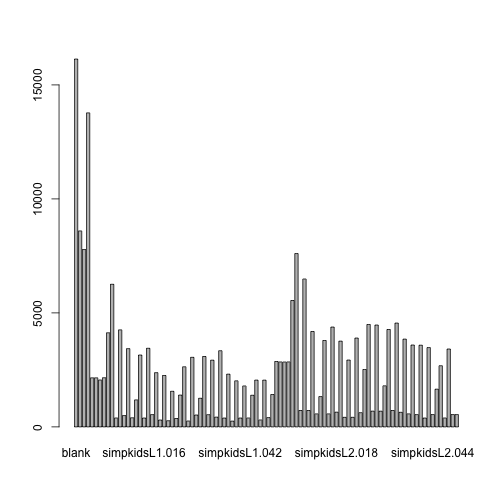
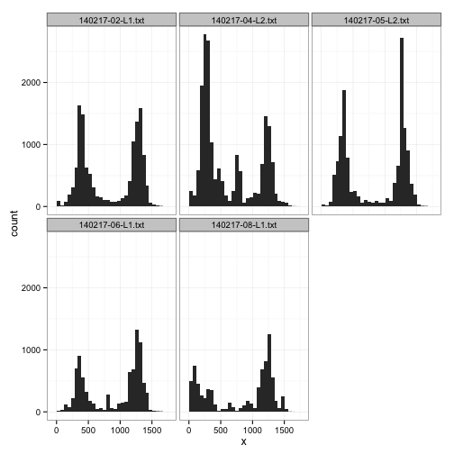
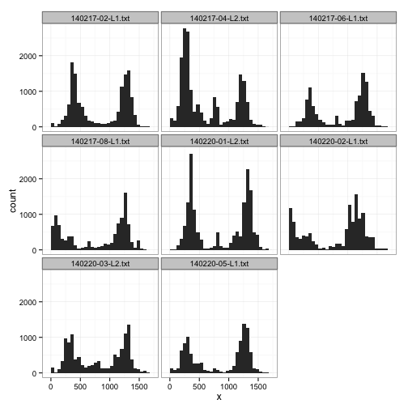
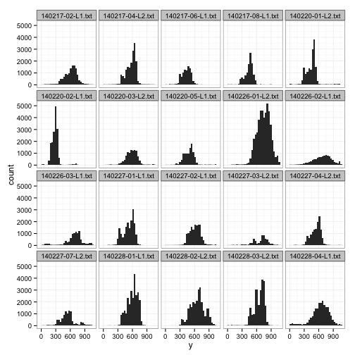
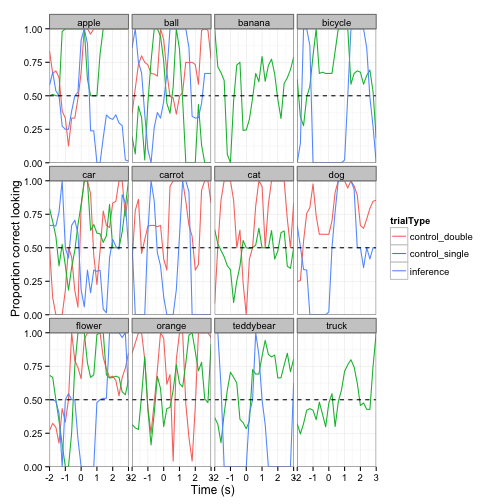
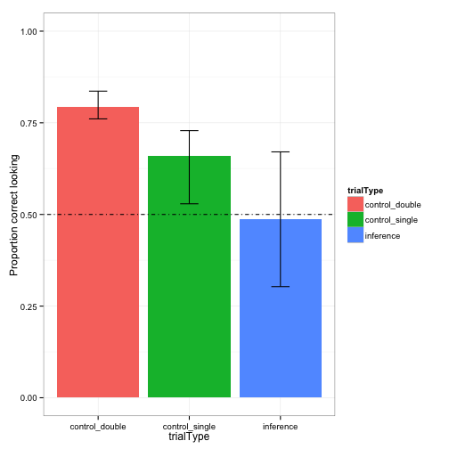
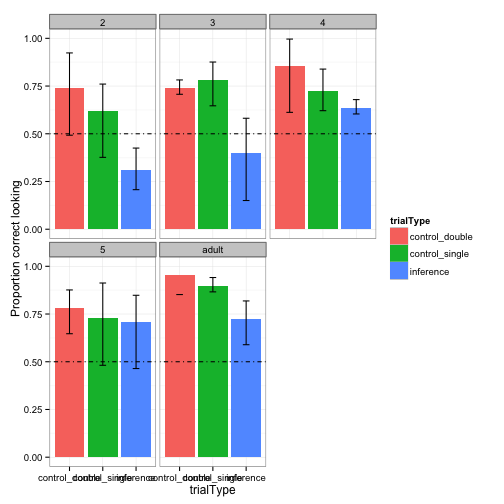

EJY Simpimp: Data analysis for eye-tracking (SIMPKID- 140224)
========================================================
### BEFORE STARTING
Before working on preprocessing and analyzing the data, make sure you have: 
- converted your idf file into a txt file using the idf converter. Refer to langcog wiki if you don't know how to do this!
- changed your raw data file name if needed.
- (If this is your first time analyzing some eye-tracking data) gone to et-ana.googlecode.com and clicked on: Source -> Browse -> (Directory) trunk, and downloaded: 
  et_helper.R, praglook_ana.R, praglook_preprocess.R, praglook_sanitycheck.R, useful.R (Change the names of these files to be specific for your own experiment: for example, my file was simpimp_preprocess.R because my experiment is called simpimp).
- created a directory for data analysis that have these following folders within: 
  1) raw_data: where you put the raw data in txt format!
  2) processed_data: where the processed data (i.e., rearranged version of the raw data) will be stored after running the functions below!
  3) R-scripts: for all the useful R scripts for analyses that you downloaded from et-ana webpage
  4) info: mostly for storing the 'order' file, which I'll describe later.

### PREPROCESSING

When you have these ready, you're ready to preprocess the data!
Open up the file simpimp_preprocess.R (or whatever yours is called!) on R Studio. Below I will follow the codes specified in this file step by step, to demonstrate what each thing does.

Run these first codes for some prelim prep:

```r
rm(list = ls())
setwd("/Users/ericang/Documents/Erica/Stanford/2013-Q2-Winter/Research/simpimpGIT/Data_analysis/")
source("R_scripts/useful.R")
```

```
## Warning: package 'bootstrap' was built under R version 3.0.2
```

```
## Loading required package: lattice Loading required package: Matrix
## 
## Attaching package: 'lme4'
## 
## The following object is masked from 'package:ggplot2':
## 
## fortify
```

```r
source("R_scripts/et_helper.R")
```


The R scripts specified above (useful.R, et_helper.R) are helper files that we call on for some functions needed for analyses. For example, function 'rezero.trials()' is established in the file et_helper.R. Look inside the files to see what functions are built in those!
Also, this means the name conventions your files use all have to be matched and consistent. For instance, the function 'rezero.trials()' calls on the column that specifies the onset time (i.e., exact time when the target word is produced) in your csv file. I had a trouble with this function at first, and then I discovered that the reason was because I had named the column different ('targetOnset') from the way it was specified in the function before ('target.onset'). So either go with the convention all the time, or be sure to go through these functions and change whatever was the convention that YOU used in the files you're using.

Specify the directories from which you'll get files:

```r
raw.data.path <- "raw_data/"
info.path <- "info/"
processed.data.path <- "processed_data/"
```


Below is the preprocessing stage:

```r
## LOOP TO READ IN FILES
all.data <- data.frame()
files <- dir(raw.data.path, pattern = "*.txt")
```

What we did above is to call all files with the extension 'txt' and save them into the variable 'files'.

Before we go on the next step, make sure that there are in fact 38 header rows (before the data starts), as the function below states. You can do this by opening your raw data file in a program that shows the number of rows (e.g., textWrangler).


```r
for (file.name in files) {
    print(file.name)
    
    ## these are the two functions that are most meaningful
    d <- read.smi.idf(paste(raw.data.path, file.name, sep = ""), header.rows = 35)
    d <- preprocess.data(d)
    d$subid <- file.name
    
    ## now here's where data get bound together
    all.data <- rbind(all.data, d)
}

## WRITE DATA OUT TO CSV FOR EASY ACCESS
write.csv(all.data, paste(processed.data.path, "simpimp_processed.csv", sep = ""), 
    row.names = FALSE)
```

```
## Warning: cannot open file 'processed_data/simpimp_processed.csv': No such
## file or directory
```

```
## Error: cannot open the connection
```


Now preprocessing is done! Next we save this as csv so that it can be easily accessed. (Code not shown here)

The csv file should have been saved onto the folder 'processed_data'. Open the folder and check if the file exists, and open the file to check that it's been preprocessed properly. First few rows of mine look like this:


```r
d <- read.csv("/Users/ericang/Documents/Erica/Stanford/2013-Q2-Winter/Research/simpimpGIT/Data_analysis/processed_data/simpimp_processed.csv")
head(d)
```

```
##       t      stimulus   x   y   t.stim            subid
## 1 0.000 elmo_duck.avi 630 289 0.008333 140217-02-L1.txt
## 2 0.008 elmo_duck.avi 639 269 0.016667 140217-02-L1.txt
## 3 0.017 elmo_duck.avi 641 277 0.025000 140217-02-L1.txt
## 4 0.025 elmo_duck.avi 648 293 0.033333 140217-02-L1.txt
## 5 0.033 elmo_duck.avi 648 331 0.041667 140217-02-L1.txt
## 6 0.042 elmo_duck.avi 641 303 0.050000 140217-02-L1.txt
```

```r
summary(d$subid)
```

```
## 140217-02-L1.txt 140217-04-L2.txt 140217-06-L1.txt 140217-08-L1.txt 
##            34732            37722            30773            31587 
## 140220-01-L2.txt 140220-02-L1.txt 140220-03-L2.txt 140220-04-L2.txt 
##            34565            37061            31312            17324 
## 140220-05-L1.txt 
##            31402
```


Columns:
t: how much time has passed since the exp began
x and y: coordinates where the eye gaze is. 
t.stim: how much time has passed since the stimulus 'elmo_duck.avi', for example, has started playing. 
subid: the subject id. this is the name of the raw data file, so make sure the name is a sensible one!

### KEEP AND DROP

Before analyzing the data, we need to determine keep's and drop's. Run the package 'reshape'


```r
# Libraries
library(reshape)
```

```
## Attaching package: 'reshape'
## 
## The following object is masked from 'package:plyr':
## 
## rename, round_any
## 
## The following object is masked from 'package:reshape2':
## 
## colsplit, melt, recast
## 
## The following object is masked from 'package:Matrix':
## 
## expand
```


***Read in the orders and merge them with the data***

This step was initially part of the stage after all the sanity check, but I've decided to move it here because it's useful for us to focus on the part that we care about from the start.

For this, you need to have created a csv file that specifies the onset of target word, etc., for each trial. Refer to **order1.csv** on et-ana.googlecode.com, or the columns of the order file below for an example.


```r
order <- read.csv("/Users/ericang/Documents/Erica/Stanford/2013-Q2-Winter/Research/simpimpGIT/Data_analysis/info/simpkid_order.csv")
head(order)
```

```
##         stimulus order character container targetItem      trialType
## 1 simpkidsL1.012     1      elmo     table  teddybear control_single
## 2 simpkidsL1.015     1      elmo  lunchbox      apple      inference
## 3 simpkidsL1.017     1    grover     chair        dog control_double
## 4 simpkidsL1.020     1      elmo     plate     banana control_single
## 5 simpkidsL1.022     1    grover     house        car      inference
## 6 simpkidsL1.024     1     ernie  lunchbox     orange control_single
##   trialType2 targetPos distPos targetOnset
## 1    control         R       L       6.242
## 2  inference         L       R       6.410
## 3    control         R       L       6.750
## 4    control         L       R       6.111
## 5  inference         L       R       6.213
## 6    control         R       L       6.617
```

```r

nrow(d)  # first check number of rows
```

```
## [1] 286478
```

```r
plot(d$stimulus)  # now check the stimulus ordering
```

 


What we do now is use the join function to combine the processed data with the order csv file, so that the data file now has info about the onset time, target item, target item location, etc.


```r
# now join in the orders
d <- join(d, order)  # use join rather than merge because it doesn't sort
```

```
## Joining by: stimulus
```

```r

plot(d$stimulus)  # check that nothing got messed up
```

 

```r
nrow(d)  # check the number of rows again to see it remained the same
```

```
## [1] 286478
```

```r
head(d)
```

```
##       t      stimulus   x   y   t.stim            subid order character
## 1 0.000 elmo_duck.avi 630 289 0.008333 140217-02-L1.txt    NA      <NA>
## 2 0.008 elmo_duck.avi 639 269 0.016667 140217-02-L1.txt    NA      <NA>
## 3 0.017 elmo_duck.avi 641 277 0.025000 140217-02-L1.txt    NA      <NA>
## 4 0.025 elmo_duck.avi 648 293 0.033333 140217-02-L1.txt    NA      <NA>
## 5 0.033 elmo_duck.avi 648 331 0.041667 140217-02-L1.txt    NA      <NA>
## 6 0.042 elmo_duck.avi 641 303 0.050000 140217-02-L1.txt    NA      <NA>
##   container targetItem trialType trialType2 targetPos distPos targetOnset
## 1      <NA>       <NA>      <NA>       <NA>      <NA>    <NA>          NA
## 2      <NA>       <NA>      <NA>       <NA>      <NA>    <NA>          NA
## 3      <NA>       <NA>      <NA>       <NA>      <NA>    <NA>          NA
## 4      <NA>       <NA>      <NA>       <NA>      <NA>    <NA>          NA
## 5      <NA>       <NA>      <NA>       <NA>      <NA>    <NA>          NA
## 6      <NA>       <NA>      <NA>       <NA>      <NA>    <NA>          NA
```

```
We see that the graph and number of rows did not get messed up by this operation.


```r
order2 <- read.csv("/Users/ericang/Documents/Erica/Stanford/2013-Q2-Winter/Research/simpimpGIT/Data_analysis/info/simpkid-log.csv")
head(order2)
```

```
##              subid keep_drop             reason_drop consent consent.vid
## 1 140217-01-L2.txt      drop              no_consent       N           Y
## 2 140217-02-L1.txt      keep                    <NA>       Y           Y
## 3 140217-03-L1.txt      drop prior_exposure_to_study       Y           Y
## 4 140217-04-L2.txt      keep                    <NA>       Y           Y
## 5 140217-05-L2.txt      drop        wrong_birth_date       Y           Y
## 6 140217-06-L1.txt      keep                    <NA>       Y           Y
##        dob age_group sex hispanic_latino  Race English   lang1    lang2
## 1  6/23/09         4   F               N white       5   Farsi Romanian
## 2  1/11/11         3   F               N white       5 Russian     <NA>
## 3  1/17/09         5   F               N white       5 Russian     <NA>
## 4  10/2/09         4   F               N white       5     ASL     <NA>
## 5 10/27/14        NA   F               N Asian       5  Sindhi     <NA>
## 6   5/9/11         2   F               Y white       6    <NA>     <NA>
##   lang3   parent1_ed    parent2_ed No_preemie
## 1    NA some_college  some_college          Y
## 2    NA     graduate  some_college          Y
## 3    NA     graduate  some_college          Y
## 4    NA     graduate      graduate          N
## 5    NA     graduate      graduate          Y
## 6    NA  4yr_college some_graduate          Y
```

```r

nrow(d)  # first check number of rows
```

```
## [1] 286478
```

```r
plot(d$stimulus)  # now check the stimulus ordering

# now join in the orders
d <- join(d, order2)  # use join rather than merge because it doesn't sort
```

```
## Joining by: subid
```

```r

plot(d$stimulus)  # check that nothing got messed up
```

 

```r
nrow(d)  # check the number of rows again to see it remained the same
```

```
## [1] 286478
```

```r
head(d)
```

```
##       t      stimulus   x   y   t.stim            subid order character
## 1 0.000 elmo_duck.avi 630 289 0.008333 140217-02-L1.txt    NA      <NA>
## 2 0.008 elmo_duck.avi 639 269 0.016667 140217-02-L1.txt    NA      <NA>
## 3 0.017 elmo_duck.avi 641 277 0.025000 140217-02-L1.txt    NA      <NA>
## 4 0.025 elmo_duck.avi 648 293 0.033333 140217-02-L1.txt    NA      <NA>
## 5 0.033 elmo_duck.avi 648 331 0.041667 140217-02-L1.txt    NA      <NA>
## 6 0.042 elmo_duck.avi 641 303 0.050000 140217-02-L1.txt    NA      <NA>
##   container targetItem trialType trialType2 targetPos distPos targetOnset
## 1      <NA>       <NA>      <NA>       <NA>      <NA>    <NA>          NA
## 2      <NA>       <NA>      <NA>       <NA>      <NA>    <NA>          NA
## 3      <NA>       <NA>      <NA>       <NA>      <NA>    <NA>          NA
## 4      <NA>       <NA>      <NA>       <NA>      <NA>    <NA>          NA
## 5      <NA>       <NA>      <NA>       <NA>      <NA>    <NA>          NA
## 6      <NA>       <NA>      <NA>       <NA>      <NA>    <NA>          NA
##   keep_drop reason_drop consent consent.vid     dob age_group sex
## 1      keep        <NA>       Y           Y 1/11/11         3   F
## 2      keep        <NA>       Y           Y 1/11/11         3   F
## 3      keep        <NA>       Y           Y 1/11/11         3   F
## 4      keep        <NA>       Y           Y 1/11/11         3   F
## 5      keep        <NA>       Y           Y 1/11/11         3   F
## 6      keep        <NA>       Y           Y 1/11/11         3   F
##   hispanic_latino  Race English   lang1 lang2 lang3 parent1_ed
## 1               N white       5 Russian  <NA>    NA   graduate
## 2               N white       5 Russian  <NA>    NA   graduate
## 3               N white       5 Russian  <NA>    NA   graduate
## 4               N white       5 Russian  <NA>    NA   graduate
## 5               N white       5 Russian  <NA>    NA   graduate
## 6               N white       5 Russian  <NA>    NA   graduate
##     parent2_ed No_preemie
## 1 some_college          Y
## 2 some_college          Y
## 3 some_college          Y
## 4 some_college          Y
## 5 some_college          Y
## 6 some_college          Y
```

```r
summary(d)
```

```
##        t                    stimulus            x              y       
##  Min.   :  0   blank            : 20120   Min.   :   0   Min.   :   0  
##  1st Qu.:128   elmo_tapping1.avi: 15363   1st Qu.: 263   1st Qu.: 384  
##  Median :224   elmo_duck.avi    : 11203   Median : 636   Median : 520  
##  Mean   :230   simpkidsL1.008   :  9158   Mean   : 647   Mean   : 567  
##  3rd Qu.:318   elmo_rap.avi     :  7926   3rd Qu.:1061   3rd Qu.: 687  
##  Max.   :607   simpkidsL1.010   :  7428   Max.   :1680   Max.   :1050  
##                (Other)          :215280   NA's   :8121   NA's   :8208  
##      t.stim                   subid           order         character     
##  Min.   : 0.00   140217-04-L2.txt:37722   Min.   :1        bert  : 42301  
##  1st Qu.: 1.23   140220-02-L1.txt:37061   1st Qu.:1        elmo  : 26266  
##  Median : 3.81   140217-02-L1.txt:34732   Median :1        ernie : 23648  
##  Mean   : 5.31   140220-01-L2.txt:34565   Mean   :1        grover: 36536  
##  3rd Qu.: 7.16   140217-08-L1.txt:31587   3rd Qu.:2        NA's  :157727  
##  Max.   :76.65   140220-05-L1.txt:31402   Max.   :2                       
##                  (Other)         :79409   NA's   :157727                  
##     container          targetItem              trialType     
##  chair   : 20279   car      : 15328   control_double: 34446  
##  friend  : 21957   ball     : 13690   control_single: 63185  
##  house   : 23214   teddybear: 13527   inference     : 31120  
##  lunchbox: 23257   apple    : 11708   NA's          :157727  
##  plate   : 15137   orange   : 11549                          
##  table   : 24907   (Other)  : 62949                          
##  NA's    :157727   NA's     :157727                          
##      trialType2     targetPos     distPos        targetOnset    
##  control  : 97631   L   : 63921   L   : 64830   Min.   :6       
##  inference: 31120   R   : 64830   R   : 63921   1st Qu.:6       
##  NA's     :157727   NA's:157727   NA's:157727   Median :6       
##                                                 Mean   :6       
##                                                 3rd Qu.:6       
##                                                 Max.   :7       
##                                                 NA's   :157727  
##  keep_drop                      reason_drop     consent    consent.vid
##  drop:     0   no_birth_date          :     0   N:     0   N: 34565   
##  keep:286478   no_consent             :     0   Y:286478   Y:251913   
##                prior_exposure_to_study:     0                         
##                wrong_birth_date       :     0                         
##                NA's                   :286478                         
##                                                                       
##                                                                       
##        dob          age_group    sex        hispanic_latino    Race       
##  10/2/09 :37722   Min.   :2.00   F:165941   N:224118        Asian:     0  
##  1/11/12 :37061   1st Qu.:2.00   M:120537   Y: 62360        other: 62989  
##  1/11/11 :34732   Median :3.00                              white:223489  
##  7/31/09 :34565   Mean   :3.17                                            
##  12/8/10 :31587   3rd Qu.:4.00                                            
##  11/12/10:31402   Max.   :5.00                                            
##  (Other) :79409                                                           
##     English         lang1            lang2         lang3        
##  Min.   :4.00   ASL    :37722   Oriya   :     0   Mode:logical  
##  1st Qu.:5.00   Russian:34732   Romanian:     0   NA's:286478   
##  Median :5.00   Turkish:34565   NA's    :286478                 
##  Mean   :5.18   Spanish:31587                                   
##  3rd Qu.:6.00   Arabic :31402                                   
##  Max.   :6.00   (Other):17324                                   
##                 NA's   :99146                                   
##         parent1_ed             parent2_ed     No_preemie
##  4yr_college : 48097   4yr_college  : 51889   N: 37722  
##  graduate    :201320   graduate     :132023   Y:248756  
##  some_college: 37061   some_college : 71793             
##                        some_graduate: 30773             
##                                                         
##                                                         
## 
```


There is a weird default for the eye-tracker such that when you are not looking, the coordinates recorded is (0,1050). So let's get rid of these default coordinates, by making them into NA's.


```r
d$x[d$y == "1050" & d$x == "0"] <- NA
d$y[d$y == "1050"] <- NA
head(d)
```

```
##       t      stimulus   x   y   t.stim            subid order character
## 1 0.000 elmo_duck.avi 630 289 0.008333 140217-02-L1.txt    NA      <NA>
## 2 0.008 elmo_duck.avi 639 269 0.016667 140217-02-L1.txt    NA      <NA>
## 3 0.017 elmo_duck.avi 641 277 0.025000 140217-02-L1.txt    NA      <NA>
## 4 0.025 elmo_duck.avi 648 293 0.033333 140217-02-L1.txt    NA      <NA>
## 5 0.033 elmo_duck.avi 648 331 0.041667 140217-02-L1.txt    NA      <NA>
## 6 0.042 elmo_duck.avi 641 303 0.050000 140217-02-L1.txt    NA      <NA>
##   container targetItem trialType trialType2 targetPos distPos targetOnset
## 1      <NA>       <NA>      <NA>       <NA>      <NA>    <NA>          NA
## 2      <NA>       <NA>      <NA>       <NA>      <NA>    <NA>          NA
## 3      <NA>       <NA>      <NA>       <NA>      <NA>    <NA>          NA
## 4      <NA>       <NA>      <NA>       <NA>      <NA>    <NA>          NA
## 5      <NA>       <NA>      <NA>       <NA>      <NA>    <NA>          NA
## 6      <NA>       <NA>      <NA>       <NA>      <NA>    <NA>          NA
##   keep_drop reason_drop consent consent.vid     dob age_group sex
## 1      keep        <NA>       Y           Y 1/11/11         3   F
## 2      keep        <NA>       Y           Y 1/11/11         3   F
## 3      keep        <NA>       Y           Y 1/11/11         3   F
## 4      keep        <NA>       Y           Y 1/11/11         3   F
## 5      keep        <NA>       Y           Y 1/11/11         3   F
## 6      keep        <NA>       Y           Y 1/11/11         3   F
##   hispanic_latino  Race English   lang1 lang2 lang3 parent1_ed
## 1               N white       5 Russian  <NA>    NA   graduate
## 2               N white       5 Russian  <NA>    NA   graduate
## 3               N white       5 Russian  <NA>    NA   graduate
## 4               N white       5 Russian  <NA>    NA   graduate
## 5               N white       5 Russian  <NA>    NA   graduate
## 6               N white       5 Russian  <NA>    NA   graduate
##     parent2_ed No_preemie
## 1 some_college          Y
## 2 some_college          Y
## 3 some_college          Y
## 4 some_college          Y
## 5 some_college          Y
## 6 some_college          Y
```

```r
# make a column that shows whether NA (true) or not (false)
d$count.na <- is.na(d$x)
head(d)
```

```
##       t      stimulus   x   y   t.stim            subid order character
## 1 0.000 elmo_duck.avi 630 289 0.008333 140217-02-L1.txt    NA      <NA>
## 2 0.008 elmo_duck.avi 639 269 0.016667 140217-02-L1.txt    NA      <NA>
## 3 0.017 elmo_duck.avi 641 277 0.025000 140217-02-L1.txt    NA      <NA>
## 4 0.025 elmo_duck.avi 648 293 0.033333 140217-02-L1.txt    NA      <NA>
## 5 0.033 elmo_duck.avi 648 331 0.041667 140217-02-L1.txt    NA      <NA>
## 6 0.042 elmo_duck.avi 641 303 0.050000 140217-02-L1.txt    NA      <NA>
##   container targetItem trialType trialType2 targetPos distPos targetOnset
## 1      <NA>       <NA>      <NA>       <NA>      <NA>    <NA>          NA
## 2      <NA>       <NA>      <NA>       <NA>      <NA>    <NA>          NA
## 3      <NA>       <NA>      <NA>       <NA>      <NA>    <NA>          NA
## 4      <NA>       <NA>      <NA>       <NA>      <NA>    <NA>          NA
## 5      <NA>       <NA>      <NA>       <NA>      <NA>    <NA>          NA
## 6      <NA>       <NA>      <NA>       <NA>      <NA>    <NA>          NA
##   keep_drop reason_drop consent consent.vid     dob age_group sex
## 1      keep        <NA>       Y           Y 1/11/11         3   F
## 2      keep        <NA>       Y           Y 1/11/11         3   F
## 3      keep        <NA>       Y           Y 1/11/11         3   F
## 4      keep        <NA>       Y           Y 1/11/11         3   F
## 5      keep        <NA>       Y           Y 1/11/11         3   F
## 6      keep        <NA>       Y           Y 1/11/11         3   F
##   hispanic_latino  Race English   lang1 lang2 lang3 parent1_ed
## 1               N white       5 Russian  <NA>    NA   graduate
## 2               N white       5 Russian  <NA>    NA   graduate
## 3               N white       5 Russian  <NA>    NA   graduate
## 4               N white       5 Russian  <NA>    NA   graduate
## 5               N white       5 Russian  <NA>    NA   graduate
## 6               N white       5 Russian  <NA>    NA   graduate
##     parent2_ed No_preemie count.na
## 1 some_college          Y    FALSE
## 2 some_college          Y    FALSE
## 3 some_college          Y    FALSE
## 4 some_college          Y    FALSE
## 5 some_college          Y    FALSE
## 6 some_college          Y    FALSE
```

```r

# remove those rows where column 'targetOnset' is NA (i.e., rows that are
# not showing test trials)
d <- subset(d, targetOnset != "NA")
head(d)
```

```
##           t       stimulus    x   y   t.stim            subid order
## 10045 101.4 simpkidsL1.012 1085 618 0.008333 140217-02-L1.txt     1
## 10046 101.4 simpkidsL1.012 1086 556 0.016667 140217-02-L1.txt     1
## 10047 101.4 simpkidsL1.012 1083 534 0.025000 140217-02-L1.txt     1
## 10048 101.4 simpkidsL1.012 1080 617 0.033333 140217-02-L1.txt     1
## 10049 101.4 simpkidsL1.012 1074 549 0.041667 140217-02-L1.txt     1
## 10050 101.5 simpkidsL1.012 1083 613 0.050000 140217-02-L1.txt     1
##       character container targetItem      trialType trialType2 targetPos
## 10045      elmo     table  teddybear control_single    control         R
## 10046      elmo     table  teddybear control_single    control         R
## 10047      elmo     table  teddybear control_single    control         R
## 10048      elmo     table  teddybear control_single    control         R
## 10049      elmo     table  teddybear control_single    control         R
## 10050      elmo     table  teddybear control_single    control         R
##       distPos targetOnset keep_drop reason_drop consent consent.vid
## 10045       L       6.242      keep        <NA>       Y           Y
## 10046       L       6.242      keep        <NA>       Y           Y
## 10047       L       6.242      keep        <NA>       Y           Y
## 10048       L       6.242      keep        <NA>       Y           Y
## 10049       L       6.242      keep        <NA>       Y           Y
## 10050       L       6.242      keep        <NA>       Y           Y
##           dob age_group sex hispanic_latino  Race English   lang1 lang2
## 10045 1/11/11         3   F               N white       5 Russian  <NA>
## 10046 1/11/11         3   F               N white       5 Russian  <NA>
## 10047 1/11/11         3   F               N white       5 Russian  <NA>
## 10048 1/11/11         3   F               N white       5 Russian  <NA>
## 10049 1/11/11         3   F               N white       5 Russian  <NA>
## 10050 1/11/11         3   F               N white       5 Russian  <NA>
##       lang3 parent1_ed   parent2_ed No_preemie count.na
## 10045    NA   graduate some_college          Y    FALSE
## 10046    NA   graduate some_college          Y    FALSE
## 10047    NA   graduate some_college          Y    FALSE
## 10048    NA   graduate some_college          Y    FALSE
## 10049    NA   graduate some_college          Y    FALSE
## 10050    NA   graduate some_college          Y    FALSE
```

```r

## TRIAL REJECTION: reject trials that have NAs for over 30% of their samples
trial.nas <- ddply(d, c("subid", "stimulus", "count.na"), "nrow")
trial.nas <- reshape(trial.nas, timevar = "count.na", idvar = c("subid", "stimulus"), 
    direction = "wide")
names(trial.nas) <- c("subid", "stimulus", "false", "true")
head(trial.nas)
```

```
##               subid       stimulus false true
## 1  140217-02-L1.txt simpkidsL1.012  1145   46
## 3  140217-02-L1.txt simpkidsL1.015  1051   90
## 5  140217-02-L1.txt simpkidsL1.017  1007   42
## 7  140217-02-L1.txt simpkidsL1.020  1137   62
## 9  140217-02-L1.txt simpkidsL1.022   753  112
## 11 140217-02-L1.txt simpkidsL1.024   523  183
```

```r
# calculate the proportion of non-NA's over all
trial.nas$prop <- trial.nas$false/(trial.nas$true + trial.nas$false)
summary(trial.nas)
```

```
##               subid              stimulus       false           true      
##  140217-02-L1.txt:16   simpkidsL1.012:  5   Min.   :  30   Min.   :  1.0  
##  140217-04-L2.txt:16   simpkidsL1.015:  5   1st Qu.: 550   1st Qu.: 58.8  
##  140217-06-L1.txt:16   simpkidsL1.017:  5   Median : 874   Median :172.0  
##  140217-08-L1.txt:16   simpkidsL1.020:  5   Mean   : 821   Mean   :164.3  
##  140220-01-L2.txt:16   simpkidsL1.022:  5   3rd Qu.:1142   3rd Qu.:231.0  
##  140220-02-L1.txt:16   simpkidsL1.024:  5   Max.   :1201   Max.   :488.0  
##  (Other)         :43   (Other)       :109   NA's   :9      NA's   :5      
##       prop      
##  Min.   :0.181  
##  1st Qu.:0.676  
##  Median :0.827  
##  Mean   :0.793  
##  3rd Qu.:0.952  
##  Max.   :0.999  
##  NA's   :14
```

```r
reject.trials <- trial.nas[trial.nas$prop < 0.5, ]

# add a column in data that combines subid and stim (trial)
d$subtrial <- paste(d$subid, "_", d$stimulus, sep = "")
# reject trials
reject.trials$subtrial <- paste(reject.trials$subid, "_", reject.trials$stimulus, 
    sep = "")
print(reject.trials)
```

```
##                  subid       stimulus false true   prop
## 29    140217-02-L1.txt simpkidsL1.046   207  286 0.4199
## NA                <NA>           <NA>    NA   NA     NA
## NA.1              <NA>           <NA>    NA   NA     NA
## NA.2              <NA>           <NA>    NA   NA     NA
## NA.3              <NA>           <NA>    NA   NA     NA
## NA.4              <NA>           <NA>    NA   NA     NA
## 116   140217-08-L1.txt simpkidsL1.041   156  238 0.3959
## NA.5              <NA>           <NA>    NA   NA     NA
## NA.6              <NA>           <NA>    NA   NA     NA
## NA.7              <NA>           <NA>    NA   NA     NA
## 147   140220-01-L2.txt simpkidsL2.043   393  410 0.4894
## NA.8              <NA>           <NA>    NA   NA     NA
## 206   140220-03-L2.txt simpkidsL2.039   150  174 0.4630
## NA.9              <NA>           <NA>    NA   NA     NA
## 217   140220-04-L2.txt simpkidsL2.015    55  249 0.1809
## 221   140220-04-L2.txt simpkidsL2.020   284  345 0.4515
## NA.10             <NA>           <NA>    NA   NA     NA
## 226   140220-04-L2.txt simpkidsL2.027    67  231 0.2248
## 228   140220-04-L2.txt simpkidsL2.029   212  230 0.4796
## NA.11             <NA>           <NA>    NA   NA     NA
## NA.12             <NA>           <NA>    NA   NA     NA
## 232   140220-04-L2.txt simpkidsL2.036    30   53 0.3614
## NA.13             <NA>           <NA>    NA   NA     NA
## 253   140220-05-L1.txt simpkidsL1.036   244  335 0.4214
## 257   140220-05-L1.txt simpkidsL1.041   231  318 0.4208
##                              subtrial
## 29    140217-02-L1.txt_simpkidsL1.046
## NA                              NA_NA
## NA.1                            NA_NA
## NA.2                            NA_NA
## NA.3                            NA_NA
## NA.4                            NA_NA
## 116   140217-08-L1.txt_simpkidsL1.041
## NA.5                            NA_NA
## NA.6                            NA_NA
## NA.7                            NA_NA
## 147   140220-01-L2.txt_simpkidsL2.043
## NA.8                            NA_NA
## 206   140220-03-L2.txt_simpkidsL2.039
## NA.9                            NA_NA
## 217   140220-04-L2.txt_simpkidsL2.015
## 221   140220-04-L2.txt_simpkidsL2.020
## NA.10                           NA_NA
## 226   140220-04-L2.txt_simpkidsL2.027
## 228   140220-04-L2.txt_simpkidsL2.029
## NA.11                           NA_NA
## NA.12                           NA_NA
## 232   140220-04-L2.txt_simpkidsL2.036
## NA.13                           NA_NA
## 253   140220-05-L1.txt_simpkidsL1.036
## 257   140220-05-L1.txt_simpkidsL1.041
```

```r
for (i in reject.trials$subtrial) {
    d <- d[d$subtrial != i, ]
}

## SUBJECT REJECTION: reject trials that have NAs for over 30% of their
## trials
subject.nas <- ddply(d, c("subid", "stimulus"), "nrow")
subject.nas2 <- ddply(subject.nas, "subid", "nrow")
print(subject.nas2)
```

```
##              subid nrow
## 1 140217-02-L1.txt   15
## 2 140217-04-L2.txt   16
## 3 140217-06-L1.txt   16
## 4 140217-08-L1.txt   15
## 5 140220-01-L2.txt   15
## 6 140220-02-L1.txt   16
## 7 140220-03-L2.txt   15
## 8 140220-04-L2.txt    6
## 9 140220-05-L1.txt   14
```

```r
## reject subjects that have less than 70% of the trials remaining (11 out of
## 16)
reject.subjects <- subject.nas2[subject.nas2$nrow < 8, ]
print(reject.subjects)
```

```
##              subid nrow
## 8 140220-04-L2.txt    6
```

```r
for (i in reject.subjects$subid) {
    d <- d[d$subid != i, ]
}
```


NOTE: weirdly, the subject that I thought did great(140220-02) was dropped (only 10 good trials) maybe worth changing the criteria at this point?

### SANITY CHECK
Now let's do some sanity check.
Open up the file simpimp_sanitycheck.R, and run the preliminary codes again.

First let's look at the distribution of data:

```r
# do histograms of the data for x and y coordinates
hist(d$x)
```

 

```r
hist(d$y)
```

 


First histogram shows tha distribution of eye gaze across x coordinates. 

(Note: dimensions of the eye-tracker screen are 1680 x 1050, check if the numbers on the histogram make sense based on those numbers!)

Below are some alternative ways to visualize the distribution, separating by subjects:


```r
# break down by subject
qplot(x, facets = ~subid, geom = "histogram", data = d)
```

```
## stat_bin: binwidth defaulted to range/30. Use 'binwidth = x' to adjust
## this. stat_bin: binwidth defaulted to range/30. Use 'binwidth = x' to
## adjust this. stat_bin: binwidth defaulted to range/30. Use 'binwidth = x'
## to adjust this. stat_bin: binwidth defaulted to range/30. Use 'binwidth =
## x' to adjust this. stat_bin: binwidth defaulted to range/30. Use 'binwidth
## = x' to adjust this. stat_bin: binwidth defaulted to range/30. Use
## 'binwidth = x' to adjust this. stat_bin: binwidth defaulted to range/30.
## Use 'binwidth = x' to adjust this. stat_bin: binwidth defaulted to
## range/30. Use 'binwidth = x' to adjust this.
```

 

```r
qplot(y, facets = ~subid, geom = "histogram", data = d)
```

```
## stat_bin: binwidth defaulted to range/30. Use 'binwidth = x' to adjust
## this. stat_bin: binwidth defaulted to range/30. Use 'binwidth = x' to
## adjust this. stat_bin: binwidth defaulted to range/30. Use 'binwidth = x'
## to adjust this. stat_bin: binwidth defaulted to range/30. Use 'binwidth =
## x' to adjust this. stat_bin: binwidth defaulted to range/30. Use 'binwidth
## = x' to adjust this. stat_bin: binwidth defaulted to range/30. Use
## 'binwidth = x' to adjust this. stat_bin: binwidth defaulted to range/30.
## Use 'binwidth = x' to adjust this. stat_bin: binwidth defaulted to
## range/30. Use 'binwidth = x' to adjust this.
```

 


Next, we check the location of fixations. Here we'll visualize how the gazes looked on the screen:


```r
qplot(x, y, data = d, facets = ~subid)
```

```
## Warning: Removed 1897 rows containing missing values (geom_point).
## Warning: Removed 1575 rows containing missing values (geom_point).
## Warning: Removed 2857 rows containing missing values (geom_point).
## Warning: Removed 2958 rows containing missing values (geom_point).
## Warning: Removed 918 rows containing missing values (geom_point). Warning:
## Removed 5157 rows containing missing values (geom_point). Warning: Removed
## 2622 rows containing missing values (geom_point). Warning: Removed 2482
## rows containing missing values (geom_point).
```

 


The cool graph below helps us visualize the main regions where the gazes fell. 


```r
qplot(x, y, geom = "density2d", data = d, xlim = c(0, 1680), ylim = c(0, 1050), 
    facets = ~subid)
```

```
## Warning: Removed 1897 rows containing non-finite values (stat_density2d).
## Warning: Removed 1575 rows containing non-finite values (stat_density2d).
## Warning: Removed 2857 rows containing non-finite values (stat_density2d).
## Warning: Removed 2958 rows containing non-finite values (stat_density2d).
## Warning: Removed 918 rows containing non-finite values (stat_density2d).
## Warning: Removed 5157 rows containing non-finite values (stat_density2d).
## Warning: Removed 2622 rows containing non-finite values (stat_density2d).
## Warning: Removed 2482 rows containing non-finite values (stat_density2d).
```

 


### DATA ANALYSES

Now we're ready for the fun part: data analyses!
Again, run the prelim codes for sourcing scripts.

***PRELIMINARIES***
***1. Read in the orders and merge them with the data***
NOTE: I've now moved this step to the beginning of the sanity check part, since I need to take into account what trials are the ones that count

***2. Define the target ROIs (regions of interest)***

At this stage, we define the regions of interest, which are the regions upon which the gazes fell that we care about. 


```r
rois <- list()
rois[[1]] <- c(0, 250, 840, 550)  # left
rois[[2]] <- c(840, 250, 840, 550)  # right
names(rois) <- c("L", "R")
roi.image(rois)
```

 


We are using the function 'roi.image' that was specified in our helper file et_helper.R. 


```r
# use check code to make sure that ROIs look right
d$roi <- roi.check(d, rois)

# see how the distribution of ROIs looks
qplot(roi, data = d)
```

 


Why the left bias?


```r
LR <- ddply(d, c("subid", "roi", "trialType"), "nrow")
LR <- reshape(LR, timevar = "roi", idvar = c("subid", "trialType"), direction = "wide")
```

```
## Warning: there are records with missing times, which will be dropped.
```

```r
names(LR) <- c("subid", "trial", "leftLook", "rightLook")
# calculate the proportion of non-NA's over all
LR$prop <- LR$leftLook/(LR$leftLook + LR$rightLook)
print(LR)
```

```
##               subid          trial leftLook rightLook   NA   prop
## 1  140217-02-L1.txt control_double     2002      1802  624 0.5263
## 2  140217-02-L1.txt control_single     2765      3085 1643 0.4726
## 3  140217-02-L1.txt      inference     1347      1070  529 0.5573
## 10 140217-04-L2.txt control_double     3114      1275  404 0.7095
## 11 140217-04-L2.txt control_single     6208      2481  853 0.7145
## 12 140217-04-L2.txt      inference     2761      1452  582 0.6554
## 19 140217-06-L1.txt control_double     1021      1548  764 0.3974
## 20 140217-06-L1.txt control_single     1747      2569 1761 0.4048
## 21 140217-06-L1.txt      inference     1238      1572  594 0.4406
## 28 140217-08-L1.txt control_double     1161      1523  936 0.4326
## 29 140217-08-L1.txt control_single     2222      2902 1251 0.4336
## 30 140217-08-L1.txt      inference      895      1057  978 0.4585
## 37 140220-01-L2.txt control_double     1825      1642   91 0.5264
## 38 140220-01-L2.txt control_single     3303      4149 1053 0.4432
## 39 140220-01-L2.txt      inference     2274      2119  210 0.5176
## 46 140220-02-L1.txt control_double     1113      1755 1788 0.3881
## 47 140220-02-L1.txt control_single     2310      2719 4154 0.4593
## 48 140220-02-L1.txt      inference      763       451 3069 0.6285
## 55 140220-03-L2.txt control_double     1197      1585  917 0.4303
## 56 140220-03-L2.txt control_single     2822      2653 1620 0.5154
## 57 140220-03-L2.txt      inference     1172       902  435 0.5651
## 64 140220-05-L1.txt control_double     1635      1700  748 0.4903
## 65 140220-05-L1.txt control_single     1680      2322 1199 0.4198
## 66 140220-05-L1.txt      inference     1132      1516  931 0.4275
```


Seems like one subject has a strong left bias. Should be worried?


```r
# set up correctness
d$correct <- d$roi == d$targetPos
```


Here we are saying that if the ROI fell in the region where the target item is positioned, then the column 'correct' will reflect this.


```r
# another way to organize by ROI's: set up three possible regions
d$target <- ifelse(d$roi == d$targetPos, "1", "0")
d$dist <- ifelse(d$roi == d$distPos, "1", "0")
```


***3. Align trials to the onset of the critical word***

Here we "create timestamps starting from the point of disambiguation".


```r
d <- rezero.trials(d)  # specified in et_helper.R
```


***4. subsample the data so that you get smooth curves***

From Mike: I like to do this when I don't have much data so that I'm not distracted by the variation in the data, but then relax the subsampling if I have more data.


```r
subsample.hz <- 5  # 10 hz is decent, eventually we should set to 30 or 60 hz
d$t.crit.binned <- round(d$t.crit * subsample.hz)/subsample.hz  # subsample step
```


***ANALYSES***

From Mike:every analysis has two parts: an aggregation step and a plotting step
- aggregation averages over some kind of unit of interest, e.g. trial type
- and then plotting is making a picture relative to that aggregation

***1. TRIAL TYPE ANALYSIS***

```r
## 1a. overall
ms <- aggregate(correct ~ t.crit.binned + trialType, d, mean)

qplot(t.crit.binned, correct, colour = trialType, geom = "line", data = ms) + 
    geom_hline(yintercept = 0.5, lty = 4) + geom_vline(xintercept = 0, lty = 3) + 
    xlab("Time (s)") + ylab("Proportion correct looking") + scale_x_continuous(limits = c(-4, 
    4), expand = c(0, 0)) + scale_y_continuous(limits = c(0, 1), expand = c(0, 
    0))  # make the axes start at 0
```

```
## Warning: Removed 41 rows containing missing values (geom_path).
```

 

```r

## 1aa. overall: just inference vs. control distinction
ms <- aggregate(correct ~ t.crit.binned + trialType2, d, mean)

qplot(t.crit.binned, correct, colour = trialType2, geom = "line", data = ms) + 
    geom_hline(yintercept = 0.5, lty = 4) + geom_vline(xintercept = 0, lty = 3) + 
    xlab("Time (s)") + ylab("Proportion correct looking") + scale_x_continuous(limits = c(-4, 
    4), expand = c(0, 0)) + scale_y_continuous(limits = c(0, 1), expand = c(0, 
    0))  # make the axes start at 0
```

```
## Warning: Removed 27 rows containing missing values (geom_path).
```

 

```r

## 1a+ add error bars with 95% CI
mss <- aggregate(correct ~ t.crit.binned + trialType2 + subid, d, mean)
ms <- aggregate(correct ~ t.crit.binned + trialType2, mss, mean)
ms$cih <- aggregate(correct ~ t.crit.binned + trialType2, mss, ci.high)$correct
ms$cil <- aggregate(correct ~ t.crit.binned + trialType2, mss, ci.low)$correct

qplot(t.crit.binned, correct, colour = trialType2, geom = "line", data = ms) + 
    geom_pointrange(aes(ymin = correct - cil, ymax = correct + cih), position = position_dodge(0.05)) + 
    geom_hline(yintercept = 0.5, lty = 4) + geom_vline(xintercept = 0, lty = 3) + 
    xlab("Time (s)") + ylab("Proportion correct looking") + scale_x_continuous(limits = c(-4, 
    3), expand = c(0, 0)) + scale_y_continuous(limits = c(0, 1), expand = c(0, 
    0))  # make the axes start at 0
```

```
## Warning: Removed 36 rows containing missing values (geom_path). Warning:
## Removed 20 rows containing missing values (geom_segment). Warning: Removed
## 20 rows containing missing values (geom_point). Warning: Removed 18 rows
## containing missing values (geom_segment). Warning: Removed 18 rows
## containing missing values (geom_point).
```

 

```r

## loess
ms <- aggregate(correct ~ t.crit.binned + trialType, d, mean)

qplot(t.crit.binned, correct, colour = trialType, geom = "point", data = ms) + 
    geom_hline(yintercept = 0.5, lty = 4) + geom_vline(xintercept = 0, lty = 3) + 
    geom_smooth(method = "loess", span = 0.5) + xlab("Time (s)") + ylab("Proportion correct looking") + 
    scale_x_continuous(limits = c(-2, 4), expand = c(0, 0)) + scale_y_continuous(limits = c(0, 
    1), expand = c(0, 0))
```

```
## Warning: Removed 24 rows containing missing values (stat_smooth). Warning:
## Removed 24 rows containing missing values (stat_smooth). Warning: Removed
## 23 rows containing missing values (stat_smooth). Warning: Removed 71 rows
## containing missing values (geom_point).
```

 


Now let's try to make a graph that shows both possible eye-gaze locations: target and distractor. 


```r
## gaze at target vs. distractor
subsample.hz <- 5  # 10 hz is decent, eventually we should set to 30 or 60 hz
d$t.crit.binned <- round(d$t.crit * subsample.hz)/subsample.hz  # subsample step

melted = melt(d, id = c("t.crit.binned", "trialType2"), measure = c("target", 
    "dist"), value.name = "Looks", variable.name = "Region")
melted$value = to.n(melted$value)

ms <- aggregate(value ~ variable + t.crit.binned + trialType2, melted, mean)

qplot(t.crit.binned, value, colour = trialType2, linetype = variable, geom = "line", 
    data = ms) + geom_hline(yintercept = 0.5, lty = 4) + geom_vline(xintercept = 0, 
    lty = 3) + xlab("Time (s)") + ylab("Proportion Looking") + scale_x_continuous(limits = c(-4, 
    3), expand = c(0, 0)) + scale_y_continuous(limits = c(0, 1), expand = c(0, 
    0))  # make the axes start at 0
```

```
## Warning: Removed 72 rows containing missing values (geom_path).
```

 


Splitting by target location:


```r
## 1e. target positions
ms <- aggregate(correct ~ t.crit.binned + trialType + targetPos, d, mean)

qplot(t.crit.binned, correct, colour = trialType, geom = "point", data = ms) + 
    facet_grid(. ~ targetPos) + geom_hline(yintercept = 0.5, lty = 4) + geom_vline(xintercept = 0, 
    lty = 3) + geom_smooth() + xlab("Time (s)") + ylab("Proportion correct looking") + 
    scale_x_continuous(limits = c(-3, 3), expand = c(0, 0)) + scale_y_continuous(limits = c(0, 
    1), expand = c(0, 0))  # make the axes start at 0
```

```
## geom_smooth: method="auto" and size of largest group is <1000, so using
## loess. Use 'method = x' to change the smoothing method.
```

```
## Warning: Removed 22 rows containing missing values (stat_smooth). Warning:
## Removed 23 rows containing missing values (stat_smooth). Warning: Removed
## 21 rows containing missing values (stat_smooth).
```

```
## geom_smooth: method="auto" and size of largest group is <1000, so using
## loess. Use 'method = x' to change the smoothing method.
```

```
## Warning: Removed 23 rows containing missing values (stat_smooth). Warning:
## Removed 23 rows containing missing values (stat_smooth). Warning: Removed
## 22 rows containing missing values (stat_smooth). Warning: Removed 66 rows
## containing missing values (geom_point). Warning: Removed 68 rows
## containing missing values (geom_point).
```

 


Then we see how each partcipant performed:


```r
## 1b. by participant
ms <- aggregate(correct ~ t.crit.binned + trialType + subid, d, mean)

qplot(t.crit.binned, correct, colour = trialType, geom = "point", data = ms) + 
    facet_wrap(~subid) + geom_hline(yintercept = 0.5, lty = 4) + geom_vline(xintercept = 0, 
    lty = 3) + geom_smooth() + xlab("Time (s)") + ylab("Proportion correct looking") + 
    scale_x_continuous(limits = c(-4, 5), expand = c(0, 0)) + scale_y_continuous(limits = c(0, 
    1), expand = c(0, 0))  # make the axes start at 0
```

```
## geom_smooth: method="auto" and size of largest group is <1000, so using
## loess. Use 'method = x' to change the smoothing method.
```

```
## Warning: Removed 13 rows containing missing values (stat_smooth). Warning:
## Removed 11 rows containing missing values (stat_smooth). Warning: Removed
## 12 rows containing missing values (stat_smooth).
```

```
## geom_smooth: method="auto" and size of largest group is <1000, so using
## loess. Use 'method = x' to change the smoothing method.
```

```
## Warning: Removed 13 rows containing missing values (stat_smooth). Warning:
## Removed 14 rows containing missing values (stat_smooth). Warning: Removed
## 13 rows containing missing values (stat_smooth).
```

```
## geom_smooth: method="auto" and size of largest group is <1000, so using
## loess. Use 'method = x' to change the smoothing method.
```

```
## Warning: Removed 14 rows containing missing values (stat_smooth). Warning:
## Removed 13 rows containing missing values (stat_smooth). Warning: Removed
## 12 rows containing missing values (stat_smooth).
```

```
## geom_smooth: method="auto" and size of largest group is <1000, so using
## loess. Use 'method = x' to change the smoothing method.
```

```
## Warning: Removed 14 rows containing missing values (stat_smooth). Warning:
## Removed 13 rows containing missing values (stat_smooth). Warning: Removed
## 12 rows containing missing values (stat_smooth).
```

```
## geom_smooth: method="auto" and size of largest group is <1000, so using
## loess. Use 'method = x' to change the smoothing method.
```

```
## Warning: Removed 13 rows containing missing values (stat_smooth). Warning:
## Removed 14 rows containing missing values (stat_smooth). Warning: Removed
## 13 rows containing missing values (stat_smooth).
```

```
## geom_smooth: method="auto" and size of largest group is <1000, so using
## loess. Use 'method = x' to change the smoothing method.
```

```
## Warning: Removed 14 rows containing missing values (stat_smooth). Warning:
## Removed 13 rows containing missing values (stat_smooth). Warning: Removed
## 12 rows containing missing values (stat_smooth).
```

```
## geom_smooth: method="auto" and size of largest group is <1000, so using
## loess. Use 'method = x' to change the smoothing method.
```

```
## Warning: Removed 13 rows containing missing values (stat_smooth). Warning:
## Removed 14 rows containing missing values (stat_smooth). Warning: Removed
## 13 rows containing missing values (stat_smooth).
```

```
## geom_smooth: method="auto" and size of largest group is <1000, so using
## loess. Use 'method = x' to change the smoothing method.
```

```
## Warning: Removed 13 rows containing missing values (stat_smooth). Warning:
## Removed 13 rows containing missing values (stat_smooth). Warning: Removed
## 12 rows containing missing values (stat_smooth). Warning: Removed 36 rows
## containing missing values (geom_point). Warning: Removed 40 rows
## containing missing values (geom_point). Warning: Removed 39 rows
## containing missing values (geom_point). Warning: Removed 39 rows
## containing missing values (geom_point). Warning: Removed 40 rows
## containing missing values (geom_point). Warning: Removed 39 rows
## containing missing values (geom_point). Warning: Removed 40 rows
## containing missing values (geom_point). Warning: Removed 38 rows
## containing missing values (geom_point). Warning: Removed 4 rows containing
## missing values (geom_path). Warning: Removed 4 rows containing missing
## values (geom_path). Warning: Removed 4 rows containing missing values
## (geom_path). Warning: Removed 2 rows containing missing values
## (geom_path). Warning: Removed 3 rows containing missing values
## (geom_path). Warning: Removed 1 rows containing missing values
## (geom_path). Warning: Removed 1 rows containing missing values
## (geom_path). Warning: Removed 1 rows containing missing values
## (geom_path). Warning: Removed 1 rows containing missing values
## (geom_path).
```

 


By age:


```r
## 1c. age loess
ms <- aggregate(correct ~ t.crit.binned + trialType + age_group, d, mean)

qplot(t.crit.binned, correct, colour = trialType, geom = "point", data = ms) + 
    facet_wrap(~age_group) + geom_hline(yintercept = 0.5, lty = 4) + geom_vline(xintercept = 0, 
    lty = 3) + geom_smooth() + xlab("Time (s)") + ylab("Proportion correct looking") + 
    scale_x_continuous(limits = c(-4, 5), expand = c(0, 0)) + scale_y_continuous(limits = c(0, 
    1), expand = c(0, 0))  # make the axes start at 0
```

```
## geom_smooth: method="auto" and size of largest group is <1000, so using
## loess. Use 'method = x' to change the smoothing method.
```

```
## Warning: Removed 14 rows containing missing values (stat_smooth). Warning:
## Removed 13 rows containing missing values (stat_smooth). Warning: Removed
## 12 rows containing missing values (stat_smooth).
```

```
## geom_smooth: method="auto" and size of largest group is <1000, so using
## loess. Use 'method = x' to change the smoothing method.
```

```
## Warning: Removed 14 rows containing missing values (stat_smooth). Warning:
## Removed 13 rows containing missing values (stat_smooth). Warning: Removed
## 12 rows containing missing values (stat_smooth).
```

```
## geom_smooth: method="auto" and size of largest group is <1000, so using
## loess. Use 'method = x' to change the smoothing method.
```

```
## Warning: Removed 13 rows containing missing values (stat_smooth). Warning:
## Removed 14 rows containing missing values (stat_smooth). Warning: Removed
## 13 rows containing missing values (stat_smooth).
```

```
## geom_smooth: method="auto" and size of largest group is <1000, so using
## loess. Use 'method = x' to change the smoothing method.
```

```
## Warning: Removed 13 rows containing missing values (stat_smooth). Warning:
## Removed 14 rows containing missing values (stat_smooth). Warning: Removed
## 13 rows containing missing values (stat_smooth). Warning: Removed 39 rows
## containing missing values (geom_point). Warning: Removed 39 rows
## containing missing values (geom_point). Warning: Removed 40 rows
## containing missing values (geom_point). Warning: Removed 40 rows
## containing missing values (geom_point). Warning: Removed 1 rows containing
## missing values (geom_path).
```

 


Order effect?


```r
## 1d. order
ms <- aggregate(correct ~ t.crit.binned + trialType + order, d, mean)

qplot(t.crit.binned, correct, colour = trialType, geom = "point", data = ms) + 
    facet_wrap(~order) + geom_hline(yintercept = 0.5, lty = 4) + geom_vline(xintercept = 0, 
    lty = 3) + geom_smooth() + xlab("Time (s)") + ylab("Proportion correct looking") + 
    scale_x_continuous(limits = c(-4, 5), expand = c(0, 0)) + scale_y_continuous(limits = c(0, 
    1), expand = c(0, 0))  # make the axes start at 0
```

```
## geom_smooth: method="auto" and size of largest group is <1000, so using
## loess. Use 'method = x' to change the smoothing method.
```

```
## Warning: Removed 14 rows containing missing values (stat_smooth). Warning:
## Removed 14 rows containing missing values (stat_smooth). Warning: Removed
## 13 rows containing missing values (stat_smooth).
```

```
## geom_smooth: method="auto" and size of largest group is <1000, so using
## loess. Use 'method = x' to change the smoothing method.
```

```
## Warning: Removed 14 rows containing missing values (stat_smooth). Warning:
## Removed 12 rows containing missing values (stat_smooth). Warning: Removed
## 12 rows containing missing values (stat_smooth). Warning: Removed 41 rows
## containing missing values (geom_point). Warning: Removed 38 rows
## containing missing values (geom_point).
```

 


***2. BY ITEM ANALYSIS***

From Mike: this won't look good until we have a lot of data because we are dividing our data in 6 parts


```r
ms <- aggregate(correct ~ t.crit.binned + trialType + targetItem, d, mean)

qplot(t.crit.binned, correct, colour = trialType, facets = ~targetItem, geom = "line", 
    data = ms) + geom_hline(yintercept = 0.5, lty = 2) + xlab("Time (s)") + 
    ylab("Proportion correct looking") + scale_x_continuous(limits = c(-2, 3), 
    expand = c(0, 0)) + scale_y_continuous(limits = c(0, 1), expand = c(0, 0))
```

```
## Warning: Removed 75 rows containing missing values (geom_path). Warning:
## Removed 75 rows containing missing values (geom_path). Warning: Removed 26
## rows containing missing values (geom_path). Warning: Removed 50 rows
## containing missing values (geom_path). Warning: Removed 75 rows containing
## missing values (geom_path). Warning: Removed 50 rows containing missing
## values (geom_path). Warning: Removed 51 rows containing missing values
## (geom_path). Warning: Removed 50 rows containing missing values
## (geom_path). Warning: Removed 75 rows containing missing values
## (geom_path). Warning: Removed 47 rows containing missing values
## (geom_path). Warning: Removed 51 rows containing missing values
## (geom_path). Warning: Removed 25 rows containing missing values
## (geom_path).
```

 


***3. DWELL TIME IN WINDOW ANALYSIS***

From Mike: this will look good because we're averaging considerably


```r
window <- c(0.5, 4)
mss <- aggregate(correct ~ trialType + age_group, subset(d, t.crit.binned > 
    window[1] & t.crit.binned < window[2]), mean)
ms <- aggregate(correct ~ trialType, mss, mean)
ms$cih <- aggregate(correct ~ trialType, mss, ci.high)$correct
ms$cil <- aggregate(correct ~ trialType, mss, ci.low)$correct

qplot(trialType, correct, fill = trialType, stat = "identity", geom = "bar", 
    ylim = c(0, 1), data = ms) + ylab("Proportion correct looking") + geom_hline(yintercept = 0.5, 
    lty = 4) + geom_errorbar(aes(ymin = correct - cil, ymax = correct + cih, 
    width = 0.2))
```

 

```r

# by age
ms <- aggregate(correct ~ trialType + age_group, mss, mean)

qplot(trialType, correct, fill = trialType, stat = "identity", geom = "bar", 
    ylim = c(0, 1), data = ms) + ylab("Proportion correct looking") + geom_hline(yintercept = 0.5, 
    lty = 4) + facet_wrap(~age_group)
```

 


