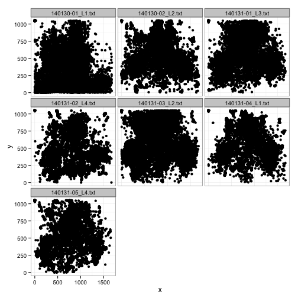
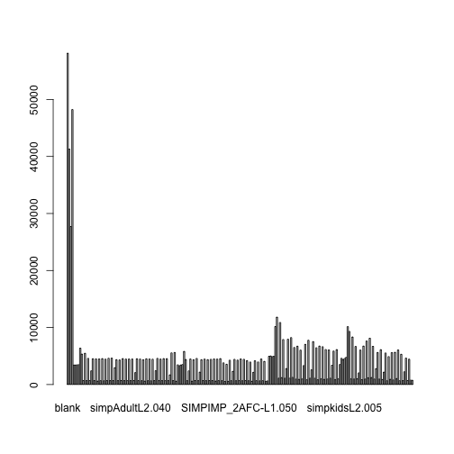
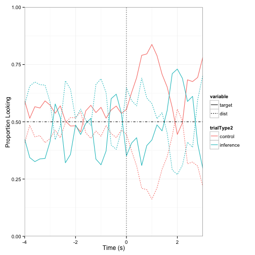

EJY Simpimp Pre-piloting data: Data analysis for eye-tracking
========================================================
### BEFORE STARTING
Before working on preprocessing and analyzing the data, make sure you have: 
- converted your idf file into a txt file using the idf converter. Refer to langcog wiki if you don't know how to do this!
- changed your raw data file name if needed.
- (If this is your first time analyzing some eye-tracking data) gone to et-ana.googlecode.com and clicked on: Source -> Browse -> (Directory) trunk, and downloaded: 
  et_helper.R, praglook_ana.R, praglook_preprocess.R, praglook_sanitycheck.R, useful.R (Change the names of these files to be specific for your own experiment: for example, my file was simpimp_preprocess.R because my experiment is called simpimp).
- created a directory for data analysis that have these following folders within: 
  1) raw_data: where you put the raw data in txt format!
  2) processed_data: where the processed data (i.e., rearranged version of the raw data) will be stored after running the functions below!
  3) R-scripts: for all the useful R scripts for analyses that you downloaded from et-ana webpage
  4) info: mostly for storing the 'order' file, which I'll describe later.

### PREPROCESSING

When you have these ready, you're ready to preprocess the data!
Open up the file simpimp_preprocess.R (or whatever yours is called!) on R Studio. Below I will follow the codes specified in this file step by step, to demonstrate what each thing does.

Run these first codes for some prelim prep:

```r
rm(list = ls())
setwd("/Users/ericang/Documents/Erica/Stanford/2013-Q2-Winter/Research/simpimpGIT/Data_analysis/")
source("R_scripts/useful.R")
```

```
## Warning: package 'bootstrap' was built under R version 3.0.2
```

```
## Loading required package: lattice Loading required package: Matrix
## 
## Attaching package: 'lme4'
## 
## The following object is masked from 'package:ggplot2':
## 
## fortify
```

```r
source("R_scripts/et_helper.R")
```


The R scripts specified above (useful.R, et_helper.R) are helper files that we call on for some functions needed for analyses. For example, function 'rezero.trials()' is established in the file et_helper.R. Look inside the files to see what functions are built in those!
Also, this means the name conventions your files use all have to be matched and consistent. For instance, the function 'rezero.trials()' calls on the column that specifies the onset time (i.e., exact time when the target word is produced) in your csv file. I had a trouble with this function at first, and then I discovered that the reason was because I had named the column different ('targetOnset') from the way it was specified in the function before ('target.onset'). So either go with the convention all the time, or be sure to go through these functions and change whatever was the convention that YOU used in the files you're using.

Specify the directories from which you'll get files:

```r
raw.data.path <- "raw_data/"
info.path <- "info/"
processed.data.path <- "processed_data/"
```


Below is the preprocessing stage:

```r
## LOOP TO READ IN FILES
all.data <- data.frame()
files <- dir(raw.data.path, pattern = "*.txt")
```

What we did above is to call all files with the extension 'txt' and save them into the variable 'files'.

Before we go on the next step, make sure that there are in fact 38 header rows (before the data starts), as the function below states. You can do this by opening your raw data file in a program that shows the number of rows (e.g., textWrangler).


```r
for (file.name in files) {
    print(file.name)
    
    ## these are the two functions that are most meaningful
    d <- read.smi.idf(paste(raw.data.path, file.name, sep = ""), header.rows = 38)
    d <- preprocess.data(d)
    d$subid <- file.name
    
    ## now here's where data get bound together
    all.data <- rbind(all.data, d)
}
```


Now preprocessing is done! Next we save this as csv so that it can be easily accessed. (Code not shown here)

The csv file should have been saved onto the folder 'processed_data'. Open the folder and check if the file exists, and open the file to check that it's been preprocessed properly. First few rows of mine look like this:


```r
d <- read.csv("/Users/ericang/Documents/Erica/Stanford/2013-Q2-Winter/Research/simpimpGIT/Data_analysis/processed_data/simpimp_processed.csv")
head(d)
```

```
##      t      stimulus x    y t.stim       subid
## 1 0.00 elmo_duck.avi 0 1050   0.05 EY-test.txt
## 2 0.05 elmo_duck.avi 0 1050   0.10 EY-test.txt
## 3 0.10 elmo_duck.avi 0 1050   0.15 EY-test.txt
## 4 0.15 elmo_duck.avi 0 1050   0.20 EY-test.txt
## 5 0.20 elmo_duck.avi 0 1050   0.25 EY-test.txt
## 6 0.25 elmo_duck.avi 0 1050   0.30 EY-test.txt
```


Columns:
t: how much time has passed since the exp began
x and y: coordinates where the eye gaze is. 
t.stim: how much time has passed since the stimulus 'elmo_duck.avi', for example, has started playing. 
subid: the subject id. this is the name of the raw data file, so make sure the name is a sensible one!

### SANITY CHECK

Now let's do some sanity check.
Open up the file simpimp_sanitycheck.R, and run the preliminary codes again.

First let's look at the distribution of data:

```r
# do histograms of the data for x and y coordinates
hist(d$x)
```

 

```r
hist(d$y)
```

 


First histogram shows tha distribution of eye gaze across x coordinates. 

(Note: dimensions of the eye-tracker screen are 1680 x 1050, check if the numbers on the histogram make sense based on those numbers!)

There is one big clump at the center and two small clumps at the left and right sides. Good news is that in my exp simpimp, there are three items on left, center, and right in test trials, so three clumps are good, but why is the center so big? Maybe due to characters being at the center for filler trials? This is something to keep in mind about, to come back to check later.

For y, we see two big clumps, which is good because there are two vertical positions we care about, one for the center items, and the other for left and right items. 

Below are some alternative ways to visualize the distribution, separating by subjects:


```r
# break down by subject HINT: use facets!
qplot(x, facets = ~subid, geom = "histogram", data = d)
```

```
## stat_bin: binwidth defaulted to range/30. Use 'binwidth = x' to adjust
## this. stat_bin: binwidth defaulted to range/30. Use 'binwidth = x' to
## adjust this.
```

 

```r
qplot(y, facets = ~subid, geom = "histogram", data = d)
```

```
## stat_bin: binwidth defaulted to range/30. Use 'binwidth = x' to adjust
## this. stat_bin: binwidth defaulted to range/30. Use 'binwidth = x' to
## adjust this.
```

 


We see that the two subjects (EY-test and EY-test2) are not very different, which is good.

Next, we check the location of fixations. Here we'll visualize how the gazes looked on the screen:


```r
qplot(x, y, data = d, facets = ~subid)
```

```
## Warning: Removed 909 rows containing missing values (geom_point). Warning:
## Removed 721 rows containing missing values (geom_point).
```

 


Notice that there are mainly three clumps, as expected, but there is another clump to the left side of the big center clump. Again, maybe that's due to some filler item that shows up there a lot? We'll need to make sure.

I don't have fixation cross trials, so instead I tried calling on some random trial number to see if the two subjects match in their looking pattern:


```r
qplot(x, y, data = subset(d, stimulus == "140121-ey-simpleImp-list1.032"), facets = ~subid)
```

```
## Warning: Removed 6 rows containing missing values (geom_point). Warning:
## Removed 76 rows containing missing values (geom_point).
```

 


The cool graph below helps us visualize the main regions where the gazes fell. 


```r
qplot(x, y, geom = "density2d", data = d, xlim = c(0, 1680), ylim = c(0, 1050), 
    facets = ~subid)
```

```
## Warning: Removed 909 rows containing non-finite values (stat_density2d).
## Warning: Removed 721 rows containing non-finite values (stat_density2d).
```

 


There is a mass at the left top corner which really shouldn't be there; this seems to be a weird default for the eye-tracker when the eye gaze is not present, assuming from the processed data file (the first few rows all have 0, 1050) Other than that and the weird lump to the left side of the center clump, nothing else strikes me as odd. 


```r
qplot(x, y, facets = ~subid, geom = "density2d", data = subset(d, stimulus == 
    "140121-ey-simpleImp-list1.032"), xlim = c(0, 1680), ylim = c(0, 1050))
```

```
## Warning: Removed 6 rows containing non-finite values (stat_density2d).
## Warning: Removed 76 rows containing non-finite values (stat_density2d).
```

 


Same idea, with the randomy selected trial. Seems that this trial had two items that were distractors for each other at C and R!

Then we check for missing data:
(**Q: what would be a reasonable number for sanity check here?**)

```r
# how many NAs are there in the dataset?

sum(is.na(d$x))
```

```
## [1] 217
```

```r

# how about for each participant?  HINT: use na.action='na.pass' to pass NAs
# through aggregate

aggregate(x ~ subid, d, function(y) {
    return(sum(is.na(y)))
}, na.action = "na.pass")
```

```
##          subid   x
## 1  EY-test.txt 161
## 2 EY-test2.txt  56
```


### DATA ANALYSES

Now we're ready for the fun part: data analyses!
Again, run the prelim codes for sourcing scripts.
(**For the codes for removing some trials, I decided to ignore them because (1) I did not have just one type of trial to remove; (2) I had already specified the trials that I care about in the order file, so I knew that other unspecified trials would have 'NA'; Is that the right thing to do though? Should I attempt to get rid of all the data for irrelevant trials?**)

***PRELIMINARIES***
***1. Read in the orders and merge them with the data***

For this, you need to have created a csv file that specifies the onset of target word, etc., for each trial. Refer to **order1.csv** on et-ana.googlecode.com, or the columns of the order file below for an example.


```r
order <- read.csv("/Users/ericang/Documents/Erica/Stanford/2013-Q2-Winter/Research/simpimpGIT/Data_analysis/info/simpimp_order.csv")
head(order)
```

```
##                        stimulus character container target trialType
## 1 140121-ey-simpleImp-list1.013      elmo    friend  truck   control
## 2 140121-ey-simpleImp-list1.014      elmo    friend  truck   control
## 3 140121-ey-simpleImp-list1.016      elmo  lunchbox  apple inference
## 4 140121-ey-simpleImp-list1.017      elmo  lunchbox  apple inference
## 5 140121-ey-simpleImp-list1.018    grover     chair    cat inference
## 6 140121-ey-simpleImp-list1.019    grover     chair    cat inference
##   targetPos distPos targetOnset
## 1         L       R       6.161
## 2         L       R       0.000
## 3         L       C       6.410
## 4         L       C       0.000
## 5         C       L       6.697
## 6         C       L       0.000
```

```r

nrow(d)  # first check number of rows
```

```
## [1] 63695
```

```r
plot(d$stimulus)  # now check the stimulus ordering
```

 


**for the plot, I can't see the ordering because the the stim names are too long; maybe I should try to change these**

What we do now is use the join function to combine the processed data with the order csv file, so that the data file now has info about the onset time, target item, target item location, etc.


```r
# now join in the orders
d <- join(d, order)  # use join rather than merge because it doesn't sort
```

```
## Joining by: stimulus
```

```r

plot(d$stimulus)  # check that nothing got messed up
```

 

```r
nrow(d)  # check the number of rows again
```

```
## [1] 63695
```


We see that the graph and number of rows did not get messed up by this operation.

***2. Define the target ROIs (regions of interest)***

At this stage, we define the regions of interest, which are the regions upon which the gazes fell that we care about. 


```r
rois <- list()
rois[[1]] <- c(0, 0, 840, 550)  # left
rois[[2]] <- c(840, 0, 840, 550)  # right
rois[[3]] <- c(420, 550, 840, 550)  # center
names(rois) <- c("L", "R", "C")
roi.image(rois)
```

 


We are using the function 'roi.image' that was specified in our helper file et_helper.R. 


```r
# use check code to make sure that ROIs look right
d$roi <- roi.check(d, rois)

# see how the distribution of ROIs looks
qplot(roi, data = d)
```

 

The graph above shows the distribution of the gazes by region. Just as we would have predicted from what we saw above, the clump for center is the biggest (something to keep in mind and check that it's not a center bias for the test trials we care about)


```r
# set up correctness
d$correct <- d$roi == d$targetPos
```

Here we are saying that if the ROI fell in the region where the target item is positioned, then the column 'correct' will reflect this.

***3. Align trials to the onset of the critical word***

Here we "create timestamps starting from the point of disambiguation".


```r
d <- rezero.trials(d)  # specified in et_helper.R
```


***4. subsample the data so that you get smooth curves***

From Mike: I like to do this when I don't have much data so that I'm not distracted by the variation in the data, but then relax the subsampling if I have more data.


```r
subsample.hz <- 10  # 10 hz is decent, eventually we should set to 30 or 60 hz
d$t.crit.binned <- round(d$t.crit * subsample.hz)/subsample.hz  # subsample step
```


***ANALYSES***

From Mike:every analysis has two parts: an aggregation step and a plotting step
- aggregation averages over some kind of unit of interest, e.g. trial type
- and then plotting is making a picture relative to that aggregation

***1. TRIAL TYPE ANALYSIS***

```r
ms <- aggregate(correct ~ t.crit.binned + trialType, d, mean)

qplot(t.crit.binned, correct, colour = trialType, geom = "line", data = ms) + 
    geom_hline(yintercept = 0.33, lty = 2) + geom_vline(xintercept = 0, lty = 3) + 
    xlab("Time (s)") + ylab("Proportion correct looking") + scale_x_continuous(limits = c(-2, 
    3), expand = c(0, 0)) + scale_y_continuous(limits = c(0, 1), expand = c(0, 
    0))  # make the axes start at 0
```

```
## Warning: Removed 110 rows containing missing values (geom_path).
```

 


Graph shows time (relative to the production onset of the target) vs. proportion of correct looking. 
Good: looking time seems to increase a lot after the onset of the target
Potentially bad: looking time starts to increase even before the onset of the target; does that mean the target could be predicted?

Add error bars:

```r
## add error bars with 95% CI
mss <- aggregate(correct ~ t.crit.binned + trialType + subid, d, mean)
ms <- aggregate(correct ~ t.crit.binned + trialType, mss, mean)
ms$cih <- aggregate(correct ~ t.crit.binned + trialType, mss, ci.high)$correct
ms$cil <- aggregate(correct ~ t.crit.binned + trialType, mss, ci.low)$correct

qplot(t.crit.binned, correct, colour = trialType, geom = "line", data = ms) + 
    geom_pointrange(aes(ymin = correct - cil, ymax = correct + cih), position = position_dodge(0.05)) + 
    geom_hline(yintercept = 0.33, lty = 2) + geom_vline(xintercept = 0, lty = 3) + 
    xlab("Time (s)") + ylab("Proportion correct looking") + scale_x_continuous(limits = c(-2, 
    3), expand = c(0, 0)) + scale_y_continuous(limits = c(0, 1), expand = c(0, 
    0))  # make the axes start at 0
```

```
## Warning: Removed 110 rows containing missing values (geom_path). Warning:
## Removed 55 rows containing missing values (geom_segment). Warning: Removed
## 55 rows containing missing values (geom_point). Warning: Removed 57 rows
## containing missing values (geom_segment). Warning: Removed 57 rows
## containing missing values (geom_point).
```

 


Good news! The error bars added in confirm that they are overall well above chance (50%).

***2. BY ITEM ANALYSIS***

From Mike: this won't look good until we have a lot of data because we are dividing our data in 6 parts


```r
ms <- aggregate(correct ~ t.crit.binned + trialType + target, d, mean)

qplot(t.crit.binned, correct, colour = trialType, facets = ~target, geom = "line", 
    data = ms) + geom_hline(yintercept = 0.33, lty = 2) + xlab("Time (s)") + 
    ylab("Proportion correct looking") + scale_x_continuous(limits = c(-2, 3), 
    expand = c(0, 0)) + scale_y_continuous(limits = c(0, 1), expand = c(0, 0))
```

```
## Warning: Removed 100 rows containing missing values (geom_path). Warning:
## Removed 99 rows containing missing values (geom_path). Warning: Removed
## 100 rows containing missing values (geom_path). Warning: Removed 100 rows
## containing missing values (geom_path). Warning: Removed 99 rows containing
## missing values (geom_path). Warning: Removed 86 rows containing missing
## values (geom_path).
```

 


***3. DWELL TIME IN WINDOW ANALYSIS***

From Mike: this will look good because we're averaging considerably


```r
window <- c(0.5, 2.5)
mss <- aggregate(correct ~ trialType + subid, subset(d, t.crit.binned > window[1] & 
    t.crit.binned < window[2]), mean)
ms <- aggregate(correct ~ trialType, mss, mean)
ms$cih <- aggregate(correct ~ trialType, mss, ci.high)$correct
ms$cil <- aggregate(correct ~ trialType, mss, ci.low)$correct

qplot(trialType, correct, fill = trialType, stat = "identity", geom = "bar", 
    ylim = c(0, 1), data = ms) + ylab("Proportion correct looking") + geom_hline(yintercept = 0.33, 
    lty = 2) + geom_errorbar(aes(ymin = correct - cil, ymax = correct + cih, 
    width = 0.2))
```

 

